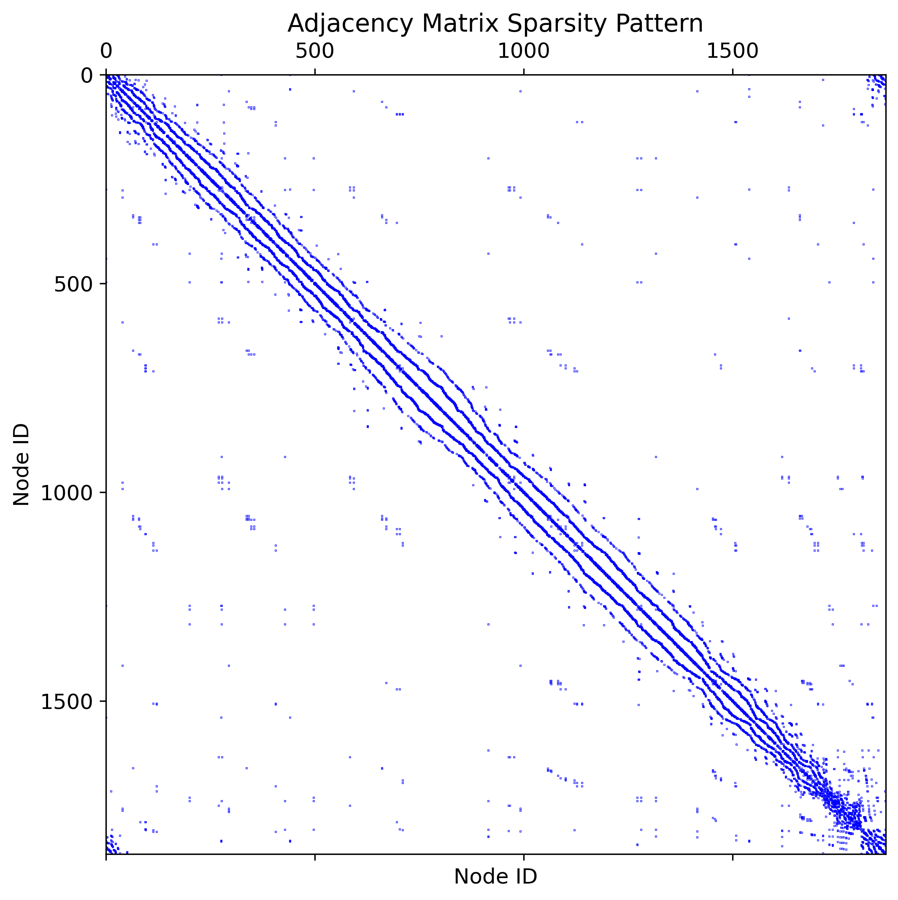
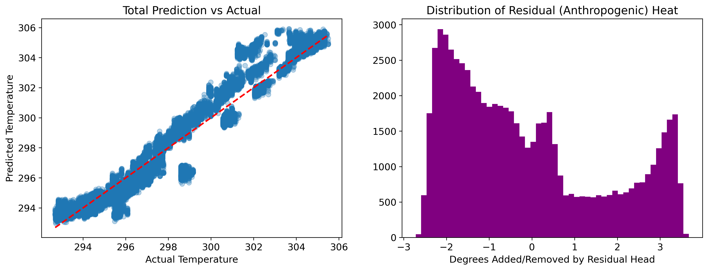

# PhyRes: Physics-Informed Residual Graph Neural Networks for Urban Heat Island Diagnostics

> Ayush Gouda, Aditya Prakash, Hema M S  
> Department of Computer Science & Engineering, RV Institute of Technology and Management

[](https://www.python.org/)
[](https://pytorch.org/)
[](https://pyg.org/)
[](LICENSE)

---

## Overview

PhyRes is a Physics-Informed Residual Graph Neural Network framework for high-resolution Urban Heat Island (UHI) diagnostics. Unlike conventional deep learning approaches that treat cities as flat Euclidean grids, PhyRes constructs a dynamic causal graph of the urban environment, where message passing is constrained by instantaneous wind vectors to respect thermodynamic causality.

A dual-head architecture separates predictions into:
- **T_phys** — the synoptic atmospheric baseline (ERA5-driven)
- **T_res** — the localised anthropogenic heat residual (morphology-driven)

This decomposition enables source apportionment: quantifying exactly how much heat is contributed by built form versus regional weather.

---

## Key Results

| City | Month | RMSE | rBldg | rVeg |
|------|-------|------|-------|------|
| Bengaluru | April | **0.920°C** | 0.800 | -0.521 |
| Bengaluru | December | 1.739°C | 0.741 | -0.702 |
| Hyderabad | April | **0.610°C** | 0.904 | -0.483 |
| Hyderabad | December | **0.764°C** | 0.925 | -0.612 |

> rBldg and rVeg denote Pearson correlation of T_res with Building Density and NDVI respectively. Cross-city generalisation (Bengaluru → Hyderabad) was performed **without hyperparameter retuning**.

---

## Architecture

```
Input: [Nodes × Time Window × Features]
         │
         ▼
┌─────────────────────┐
│   Advection Pruning  │  ← Wind-directed edge masking (hourly)
│   Dynamic Edges      │  ← Solar shifting, evapotranspiration, convective diffusion
│   Static KNN + 8-adj │
└─────────┬───────────┘
          │
          ▼
┌─────────────────────┐
│     SA-GAT Layer     │  ← Asymmetric attention (self-heat vs neighbour-heat)
└─────────┬───────────┘
          │
          ▼
┌─────────────────────┐
│   LSTM Backbone      │  ← 12-hour temporal window (thermal inertia)
└─────────┬───────────┘
          │
    ┌─────┴──────┐
    ▼            ▼
 T_phys        T_res       ← Dual-head disentanglement
    └─────┬──────┘
          ▼
       T_total
```

---

## Repository Structure

```
PhyRes-Physics-Informed-UHI-Diagnostics/
│
├── README.md
├── requirements.txt
│
├── data/
│   ├── Blr_Nodes_Final.geojson
│   └── Hyd_Nodes_Final.geojson
│
├── paper/
│   ├── AI_content_report.pdf
│   ├── PhyRes.pdf
│   └── plagiarism_report.pdf
│
├── results/
│   ├── Bangalore/
│   │   ├── April_Models/
│   │   │   ├── phyres-model.pt
│   │   │   ├── vanilla_baseline_model.pt
│   │   │   └── zero_guidance_np_model.pt
│   │   ├── Adjaceny_Check.png
│   │   ├── April_Baseline_Model_City.png
│   │   ├── April_Baseline_Model_Corr.png
│   │   ├── April_Baseline_Model_Cosine.png
│   │   ├── April_Baseline_Model_Scatter+Hist.png
│   │   ├── April_NoPruning_City.png
│   │   ├── April_NoPruning_Corr.png
│   │   ├── April_NoPruning_Cosine.png
│   │   ├── April_NoPruning_Scatter+Hist.png
│   │   ├── April_PhyRes_City.png
│   │   ├── April_PhyRes_Corr.png
│   │   ├── April_PhyRes_Cosine.png
│   │   ├── April_PhyRes_Scatter+Hist.png
│   │   ├── April_Results.txt
│   │   ├── December_Baseline_City.png
│   │   ├── December_Baseline_Cosine.png
│   │   ├── December_Baseline_Model_Corr.png
│   │   ├── December_Baseline_Model_Scatter+Hist.png
│   │   ├── December_NoPruning_City.png
│   │   ├── December_NoPruning_Corr.png
│   │   ├── December_NoPruning_Cosine.png
│   │   ├── December_NoPruning_Scatter+Hist.png
│   │   ├── December_PhyRes_City.png
│   │   ├── December_PhyRes_Cosine.png
│   │   ├── December_PhyRes_Scatter+Hist.png
│   │   ├── December_Results.txt
│   │   └── Decemeber_PhyRes_Corr.png
│   │
│   └── Hyderabad/
│       ├── April Models/
│       │   ├── phyres-model.pt
│       │   ├── vanilla_baseline_model.pt
│       │   └── zero_guidance_np_model.pt
│       ├── Adjacency_Check.png
│       ├── April_Baseline_City.png
│       ├── April_Baseline_Corr.png
│       ├── April_Baseline_Scatter+Hist.png
│       ├── April_Bsseline_Collapse.png
│       ├── April_NoPruning_City.png
│       ├── April_NoPruning_Collapse.png
│       ├── April_NoPruning_Corr.png
│       ├── April_NoPruning_Scatter+Hist.png
│       ├── April_PhyRes_City.png
│       ├── April_PhyRes_Collapse.png
│       ├── April_PhyRes_Corr.png
│       ├── April_PhyRes_Scatter+Hist.png
│       ├── April_Results.txt
│       ├── December_Baseline_City.png
│       ├── December_Baseline_Corr.png
│       ├── December_Baseline_Scatter+Hist.png
│       ├── December_Bsseline_Collapse.png
│       ├── December_NoPruning_City.png
│       ├── December_NoPruning_Collapse.png
│       ├── December_NoPruning_Corr.png
│       ├── December_NoPruning_Scatter+Hist.png
│       ├── December_PhyRes_City.png
│       ├── December_PhyRes_Collapse.png
│       ├── December_PhyRes_Corr.png
│       ├── December_PhyRes_Scatter+Hist.png
│       └── December_Results.txt
│
└── src/
    ├── main.ipynb
    ├── csv.js
    └── nodes.js
```

---

## Setup

### Prerequisites
- Google Colab (recommended, GPU runtime required) or a local CUDA 12.1 environment
- Google Drive with the data CSVs and GeoJSONs mounted at `/content/drive/MyDrive/UHI/`

### Installation

All dependencies are installed within `main.ipynb`. The pinned versions are required for PyG sparse kernel compatibility:

```bash
pip install \
  "numpy==1.26.4" \
  "torch==2.3.0+cu121" \
  "torch-geometric==2.5.3" \
  "torch-scatter==2.1.2+pt23cu121" \
  "torch-sparse==0.6.18+pt23cu121" \
  "torch-cluster==1.6.3+pt23cu121" \
  "contextily==1.6.0" \
  "rasterio==1.3.10" \
  --extra-index-url https://download.pytorch.org/whl/cu121 \
  -f https://data.pyg.org/whl/torch-2.3.0+cu121.html
```

> ⚠️ These versions intentionally conflict with some Colab defaults (numpy, torchvision). This is expected and does not affect PhyRes execution.

---

## Data

Features are ingested from three sources via Google Earth Engine:

| Feature | Source | Role |
|---------|--------|------|
| T2m, u10m, v10m | ERA5-Land | Atmospheric baseline + wind vectors |
| SWR, STR, LHF | ERA5-Land | Solar/thermal drivers |
| NDVI, NDBI | Landsat 9 | Vegetation and built-up proxies |
| H_avg, C_bldg | Google Open Buildings | Volumetric structural data |
| NO2 | Sentinel-5P | Anthropogenic heat proxy |

**Temporal coverage:** 336 hourly timesteps per city-season pair  
**Spatial coverage:** ~3,000–3,100 nodes per city at ~500m resolution  
**Train / Val / Test split:** 240 / 48 / 48 hours (chronological, no shuffle)

> The GEE data collection scripts are included in this repository under `src/nodes` and `src/csv`.

---

## Reproducing Results

Open `main.ipynb` in Google Colab with a GPU runtime and run all cells sequentially. The notebook is self-contained and covers:

1. Dependency installation and environment verification
2. Data loading and Z-score normalisation (train-statistics only)
3. Causal graph construction with advection-based pruning
4. PhyRes model definition (SA-GAT + LSTM + dual head)
5. Constrained training with composite loss (MSE + advection penalty + push-pull)
6. Evaluation on held-out test set with RMSE and Pearson correlation metrics
7. Residual heat map generation (300 DPI, basemap overlay)
8. Node collapse / over-smoothing diagnostic

To switch between city-season pairs, update the data paths at the top of the **Load and Verify Data** section:

```python
df  = pd.read_csv('/content/drive/MyDrive/UHI/<CITY_SEASON>.csv')
gdf = gpd.read_file('/content/<CITY>_Nodes_PhyRes_Final.geojson').to_crs(epsg=32643)
```

---

## Sample Outputs

**Causal Advection Pruning — Figure 1**



**Residual Heat Map — Bengaluru April**


**Residual Heat Map — Hyderabad December**


**Regression Analysis (True vs Predicted)**



---

## Ablation Summary

| Model | RMSE | Node Collapse Rate | rBldg |
|-------|------|--------------------|-------|
| PhyRes (ours) | **0.610°C** | **1.85%** | **0.925** |
| No-Pruning (static graph) | 0.951°C | 1.02% | 0.144 |
| Baseline (MSE only) | 0.615°C | 6.84% | 0.000 |

Advection-based pruning yields a **23.2× improvement** in morphological accuracy gains over soft-constraint baselines and a **73.8% reduction in FLOPs**.

---

## Citation

If you use PhyRes in your research, please cite:

```bibtex
@inproceedings{Goud2611:PhyRes,
  author    = {Ayush Gouda},
  title     = {{PhyRes: Physics-Informed Residual Graph Neural Networks for Urban Heat Island Diagnostics}},
  booktitle = {2026 IEEE India Geoscience and Remote Sensing Symposium (InGARSS 2026)},
  address   = {Hyderabad, India},
  year      = {2026}
}
```

---

## Acknowledgements

The authors acknowledge the use of the Gemini 3.1 Pro large language model for assistance in manuscript structuring and grammatical refinement. All scientific claims, architectural decisions, and data analyses were independently authored by the research team.

Data sourced from ERA5-Land (Copernicus Climate Change Service), Google Open Buildings, Landsat 9 (USGS), and Sentinel-5P (ESA).
