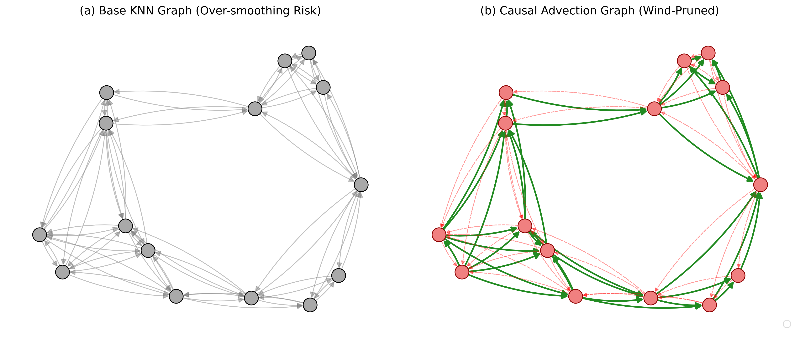
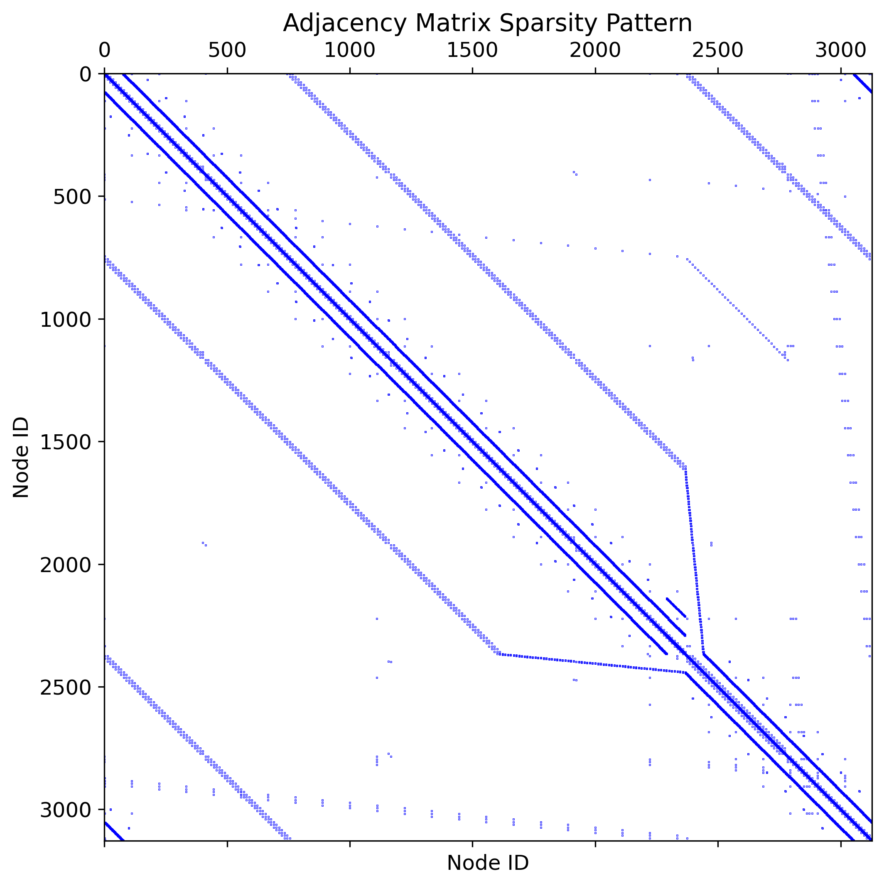
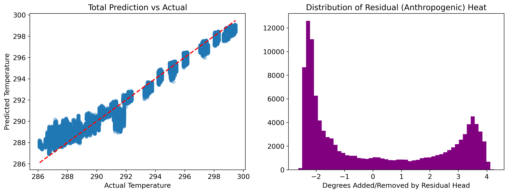
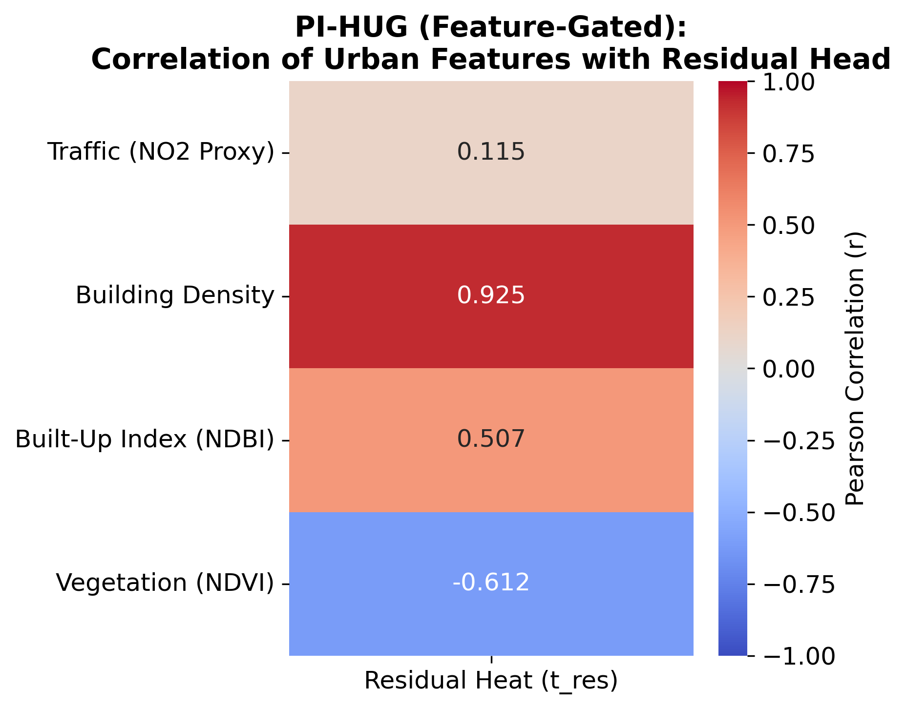
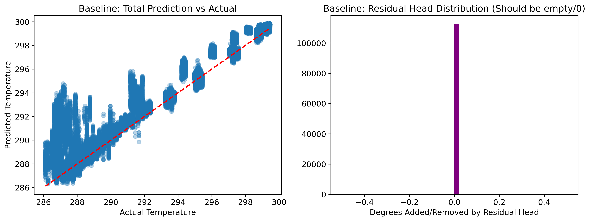
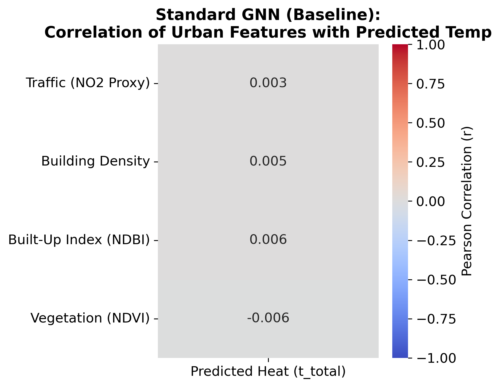
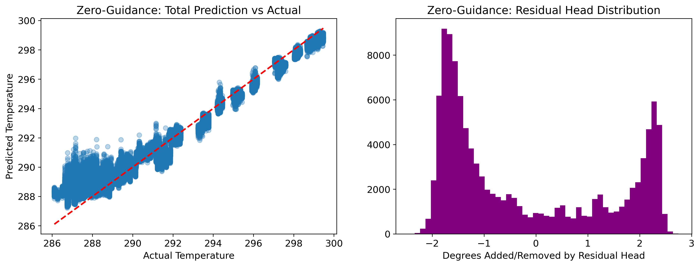
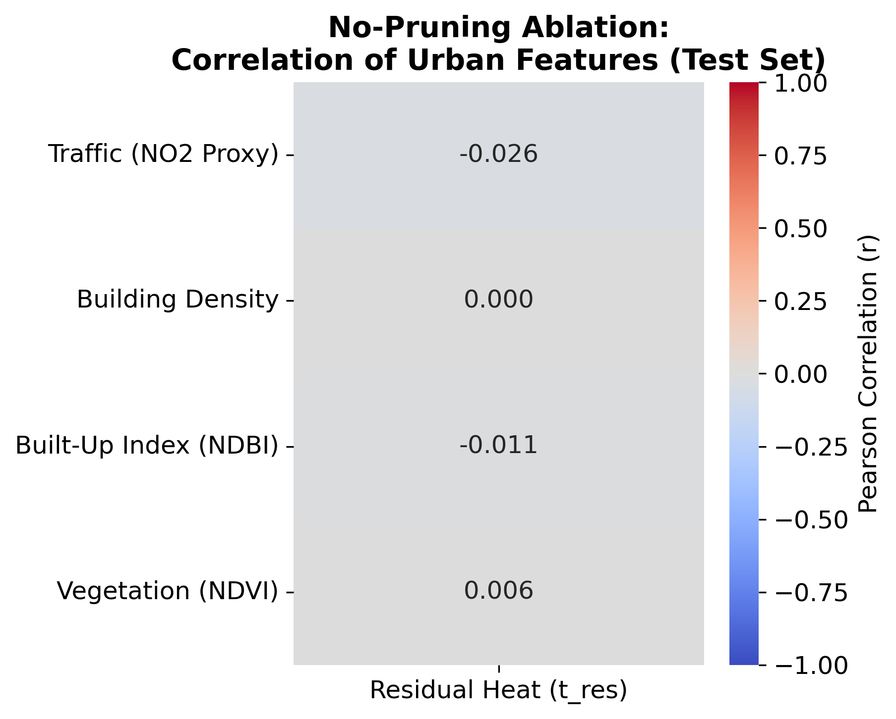

## Dependencies


```python
from google.colab import drive
drive.mount('/content/drive')
```

    Mounted at /content/drive
    


```python
!pip uninstall -y numpy torch torch-scatter torch-sparse torch-cluster torch-geometric contextily rasterio
!pip install \
    "numpy==1.26.4" \
    "torch==2.3.0+cu121" \
    "torchvision==0.18.0+cu121" \
    "torch-geometric==2.5.3" \
    "torch-scatter==2.1.2+pt23cu121" \
    "torch-sparse==0.6.18+pt23cu121" \
    "torch-cluster==1.6.3+pt23cu121" \
    "contextily==1.6.0" \
    "rasterio==1.3.10" \
    --extra-index-url https://download.pytorch.org/whl/cu121 \
    -f https://data.pyg.org/whl/torch-2.3.0+cu121.html
```

    Found existing installation: numpy 2.0.2
    Uninstalling numpy-2.0.2:
      Successfully uninstalled numpy-2.0.2
    Found existing installation: torch 2.10.0+cu128
    Uninstalling torch-2.10.0+cu128:
      Successfully uninstalled torch-2.10.0+cu128
    WARNING: Skipping torch-scatter as it is not installed.
    WARNING: Skipping torch-sparse as it is not installed.
    WARNING: Skipping torch-cluster as it is not installed.
    WARNING: Skipping torch-geometric as it is not installed.
    WARNING: Skipping contextily as it is not installed.
    Found existing installation: rasterio 1.5.0
    Uninstalling rasterio-1.5.0:
      Successfully uninstalled rasterio-1.5.0
    Looking in indexes: https://pypi.org/simple, https://download.pytorch.org/whl/cu121
    Looking in links: https://data.pyg.org/whl/torch-2.3.0+cu121.html
    Collecting numpy==1.26.4
      Downloading numpy-1.26.4-cp312-cp312-manylinux_2_17_x86_64.manylinux2014_x86_64.whl.metadata (61 kB)
         ━━━━━━━━━━━━━━━━━━━━━━━━━━━━━━━━━━━━━━━━ 61.0/61.0 kB 2.8 MB/s eta 0:00:00
    [?25hCollecting torch==2.3.0+cu121
      Downloading https://download-r2.pytorch.org/whl/cu121/torch-2.3.0%2Bcu121-cp312-cp312-linux_x86_64.whl (780.9 MB)
         ━━━━━━━━━━━━━━━━━━━━━━━━━━━━━━━━━━━━━ 780.9/780.9 MB 838.5 kB/s eta 0:00:00
    [?25hCollecting torchvision==0.18.0+cu121
      Downloading https://download-r2.pytorch.org/whl/cu121/torchvision-0.18.0%2Bcu121-cp312-cp312-linux_x86_64.whl (7.0 MB)
         ━━━━━━━━━━━━━━━━━━━━━━━━━━━━━━━━━━━━━━━━ 7.0/7.0 MB 111.1 MB/s eta 0:00:00
    [?25hCollecting torch-geometric==2.5.3
      Downloading torch_geometric-2.5.3-py3-none-any.whl.metadata (64 kB)
         ━━━━━━━━━━━━━━━━━━━━━━━━━━━━━━━━━━━━━━━━ 64.2/64.2 kB 6.7 MB/s eta 0:00:00
    [?25hCollecting torch-scatter==2.1.2+pt23cu121
      Downloading https://data.pyg.org/whl/torch-2.3.0%2Bcu121/torch_scatter-2.1.2%2Bpt23cu121-cp312-cp312-linux_x86_64.whl (10.9 MB)
         ━━━━━━━━━━━━━━━━━━━━━━━━━━━━━━━━━━━━━━━━ 10.9/10.9 MB 84.1 MB/s eta 0:00:00
    [?25hCollecting torch-sparse==0.6.18+pt23cu121
      Downloading https://data.pyg.org/whl/torch-2.3.0%2Bcu121/torch_sparse-0.6.18%2Bpt23cu121-cp312-cp312-linux_x86_64.whl (5.1 MB)
         ━━━━━━━━━━━━━━━━━━━━━━━━━━━━━━━━━━━━━━━━ 5.1/5.1 MB 133.1 MB/s eta 0:00:00
    [?25hCollecting torch-cluster==1.6.3+pt23cu121
      Downloading https://data.pyg.org/whl/torch-2.3.0%2Bcu121/torch_cluster-1.6.3%2Bpt23cu121-cp312-cp312-linux_x86_64.whl (3.4 MB)
         ━━━━━━━━━━━━━━━━━━━━━━━━━━━━━━━━━━━━━━━━ 3.4/3.4 MB 72.8 MB/s eta 0:00:00
    [?25hCollecting contextily==1.6.0
      Downloading contextily-1.6.0-py3-none-any.whl.metadata (2.9 kB)
    Collecting rasterio==1.3.10
      Downloading rasterio-1.3.10-cp312-cp312-manylinux2014_x86_64.whl.metadata (14 kB)
    Requirement already satisfied: filelock in /usr/local/lib/python3.12/dist-packages (from torch==2.3.0+cu121) (3.29.0)
    Requirement already satisfied: typing-extensions>=4.8.0 in /usr/local/lib/python3.12/dist-packages (from torch==2.3.0+cu121) (4.15.0)
    Requirement already satisfied: sympy in /usr/local/lib/python3.12/dist-packages (from torch==2.3.0+cu121) (1.14.0)
    Requirement already satisfied: networkx in /usr/local/lib/python3.12/dist-packages (from torch==2.3.0+cu121) (3.6.1)
    Requirement already satisfied: jinja2 in /usr/local/lib/python3.12/dist-packages (from torch==2.3.0+cu121) (3.1.6)
    Requirement already satisfied: fsspec in /usr/local/lib/python3.12/dist-packages (from torch==2.3.0+cu121) (2025.3.0)
    Collecting nvidia-cuda-nvrtc-cu12==12.1.105 (from torch==2.3.0+cu121)
      Downloading https://download.pytorch.org/whl/cu121/nvidia_cuda_nvrtc_cu12-12.1.105-py3-none-manylinux1_x86_64.whl (23.7 MB)
         ━━━━━━━━━━━━━━━━━━━━━━━━━━━━━━━━━━━━━━━━ 23.7/23.7 MB 77.8 MB/s eta 0:00:00
    [?25hCollecting nvidia-cuda-runtime-cu12==12.1.105 (from torch==2.3.0+cu121)
      Downloading https://download.pytorch.org/whl/cu121/nvidia_cuda_runtime_cu12-12.1.105-py3-none-manylinux1_x86_64.whl (823 kB)
         ━━━━━━━━━━━━━━━━━━━━━━━━━━━━━━━━━━━━━━ 823.6/823.6 kB 55.6 MB/s eta 0:00:00
    [?25hCollecting nvidia-cuda-cupti-cu12==12.1.105 (from torch==2.3.0+cu121)
      Downloading https://download.pytorch.org/whl/cu121/nvidia_cuda_cupti_cu12-12.1.105-py3-none-manylinux1_x86_64.whl (14.1 MB)
         ━━━━━━━━━━━━━━━━━━━━━━━━━━━━━━━━━━━━━━━ 14.1/14.1 MB 108.1 MB/s eta 0:00:00
    [?25hCollecting nvidia-cudnn-cu12==8.9.2.26 (from torch==2.3.0+cu121)
      Downloading https://download.pytorch.org/whl/cu121/nvidia_cudnn_cu12-8.9.2.26-py3-none-manylinux1_x86_64.whl (731.7 MB)
         ━━━━━━━━━━━━━━━━━━━━━━━━━━━━━━━━━━━━━━━ 731.7/731.7 MB 1.3 MB/s eta 0:00:00
    [?25hCollecting nvidia-cublas-cu12==12.1.3.1 (from torch==2.3.0+cu121)
      Downloading https://download.pytorch.org/whl/cu121/nvidia_cublas_cu12-12.1.3.1-py3-none-manylinux1_x86_64.whl (410.6 MB)
         ━━━━━━━━━━━━━━━━━━━━━━━━━━━━━━━━━━━━━━━ 410.6/410.6 MB 3.8 MB/s eta 0:00:00
    [?25hCollecting nvidia-cufft-cu12==11.0.2.54 (from torch==2.3.0+cu121)
      Downloading https://download.pytorch.org/whl/cu121/nvidia_cufft_cu12-11.0.2.54-py3-none-manylinux1_x86_64.whl (121.6 MB)
         ━━━━━━━━━━━━━━━━━━━━━━━━━━━━━━━━━━━━━━━ 121.6/121.6 MB 7.9 MB/s eta 0:00:00
    [?25hCollecting nvidia-curand-cu12==10.3.2.106 (from torch==2.3.0+cu121)
      Downloading https://download.pytorch.org/whl/cu121/nvidia_curand_cu12-10.3.2.106-py3-none-manylinux1_x86_64.whl (56.5 MB)
         ━━━━━━━━━━━━━━━━━━━━━━━━━━━━━━━━━━━━━━━━ 56.5/56.5 MB 14.5 MB/s eta 0:00:00
    [?25hCollecting nvidia-cusolver-cu12==11.4.5.107 (from torch==2.3.0+cu121)
      Downloading https://download.pytorch.org/whl/cu121/nvidia_cusolver_cu12-11.4.5.107-py3-none-manylinux1_x86_64.whl (124.2 MB)
         ━━━━━━━━━━━━━━━━━━━━━━━━━━━━━━━━━━━━━━━ 124.2/124.2 MB 7.7 MB/s eta 0:00:00
    [?25hCollecting nvidia-cusparse-cu12==12.1.0.106 (from torch==2.3.0+cu121)
      Downloading https://download.pytorch.org/whl/cu121/nvidia_cusparse_cu12-12.1.0.106-py3-none-manylinux1_x86_64.whl (196.0 MB)
         ━━━━━━━━━━━━━━━━━━━━━━━━━━━━━━━━━━━━━━━ 196.0/196.0 MB 4.6 MB/s eta 0:00:00
    [?25hCollecting nvidia-nccl-cu12==2.20.5 (from torch==2.3.0+cu121)
      Downloading https://download.pytorch.org/whl/cu121/nvidia_nccl_cu12-2.20.5-py3-none-manylinux2014_x86_64.whl (176.2 MB)
         ━━━━━━━━━━━━━━━━━━━━━━━━━━━━━━━━━━━━━━━ 176.2/176.2 MB 6.3 MB/s eta 0:00:00
    [?25hCollecting nvidia-nvtx-cu12==12.1.105 (from torch==2.3.0+cu121)
      Downloading https://download.pytorch.org/whl/cu121/nvidia_nvtx_cu12-12.1.105-py3-none-manylinux1_x86_64.whl (99 kB)
         ━━━━━━━━━━━━━━━━━━━━━━━━━━━━━━━━━━━━━━━━ 99.1/99.1 kB 12.3 MB/s eta 0:00:00
    [?25hRequirement already satisfied: pillow!=8.3.*,>=5.3.0 in /usr/local/lib/python3.12/dist-packages (from torchvision==0.18.0+cu121) (11.3.0)
    Requirement already satisfied: tqdm in /usr/local/lib/python3.12/dist-packages (from torch-geometric==2.5.3) (4.67.3)
    Requirement already satisfied: scipy in /usr/local/lib/python3.12/dist-packages (from torch-geometric==2.5.3) (1.16.3)
    Requirement already satisfied: aiohttp in /usr/local/lib/python3.12/dist-packages (from torch-geometric==2.5.3) (3.13.5)
    Requirement already satisfied: requests in /usr/local/lib/python3.12/dist-packages (from torch-geometric==2.5.3) (2.32.4)
    Requirement already satisfied: pyparsing in /usr/local/lib/python3.12/dist-packages (from torch-geometric==2.5.3) (3.3.2)
    Requirement already satisfied: scikit-learn in /usr/local/lib/python3.12/dist-packages (from torch-geometric==2.5.3) (1.6.1)
    Requirement already satisfied: psutil>=5.8.0 in /usr/local/lib/python3.12/dist-packages (from torch-geometric==2.5.3) (5.9.5)
    Requirement already satisfied: geopy in /usr/local/lib/python3.12/dist-packages (from contextily==1.6.0) (2.4.1)
    Requirement already satisfied: matplotlib in /usr/local/lib/python3.12/dist-packages (from contextily==1.6.0) (3.10.0)
    Collecting mercantile (from contextily==1.6.0)
      Downloading mercantile-1.2.1-py3-none-any.whl.metadata (4.8 kB)
    Requirement already satisfied: joblib in /usr/local/lib/python3.12/dist-packages (from contextily==1.6.0) (1.5.3)
    Requirement already satisfied: xyzservices in /usr/local/lib/python3.12/dist-packages (from contextily==1.6.0) (2026.3.0)
    Requirement already satisfied: affine in /usr/local/lib/python3.12/dist-packages (from rasterio==1.3.10) (2.4.0)
    Requirement already satisfied: attrs in /usr/local/lib/python3.12/dist-packages (from rasterio==1.3.10) (26.1.0)
    Requirement already satisfied: certifi in /usr/local/lib/python3.12/dist-packages (from rasterio==1.3.10) (2026.4.22)
    Requirement already satisfied: click>=4.0 in /usr/local/lib/python3.12/dist-packages (from rasterio==1.3.10) (8.3.3)
    Requirement already satisfied: cligj>=0.5 in /usr/local/lib/python3.12/dist-packages (from rasterio==1.3.10) (0.7.2)
    Collecting snuggs>=1.4.1 (from rasterio==1.3.10)
      Downloading snuggs-1.4.7-py3-none-any.whl.metadata (3.4 kB)
    Requirement already satisfied: click-plugins in /usr/local/lib/python3.12/dist-packages (from rasterio==1.3.10) (1.1.1.2)
    Requirement already satisfied: setuptools in /usr/local/lib/python3.12/dist-packages (from rasterio==1.3.10) (75.2.0)
    Requirement already satisfied: nvidia-nvjitlink-cu12 in /usr/local/lib/python3.12/dist-packages (from nvidia-cusolver-cu12==11.4.5.107->torch==2.3.0+cu121) (12.8.93)
    Requirement already satisfied: aiohappyeyeballs>=2.5.0 in /usr/local/lib/python3.12/dist-packages (from aiohttp->torch-geometric==2.5.3) (2.6.1)
    Requirement already satisfied: aiosignal>=1.4.0 in /usr/local/lib/python3.12/dist-packages (from aiohttp->torch-geometric==2.5.3) (1.4.0)
    Requirement already satisfied: frozenlist>=1.1.1 in /usr/local/lib/python3.12/dist-packages (from aiohttp->torch-geometric==2.5.3) (1.8.0)
    Requirement already satisfied: multidict<7.0,>=4.5 in /usr/local/lib/python3.12/dist-packages (from aiohttp->torch-geometric==2.5.3) (6.7.1)
    Requirement already satisfied: propcache>=0.2.0 in /usr/local/lib/python3.12/dist-packages (from aiohttp->torch-geometric==2.5.3) (0.4.1)
    Requirement already satisfied: yarl<2.0,>=1.17.0 in /usr/local/lib/python3.12/dist-packages (from aiohttp->torch-geometric==2.5.3) (1.23.0)
    Requirement already satisfied: geographiclib<3,>=1.52 in /usr/local/lib/python3.12/dist-packages (from geopy->contextily==1.6.0) (2.1)
    Requirement already satisfied: MarkupSafe>=2.0 in /usr/local/lib/python3.12/dist-packages (from jinja2->torch==2.3.0+cu121) (3.0.3)
    Requirement already satisfied: contourpy>=1.0.1 in /usr/local/lib/python3.12/dist-packages (from matplotlib->contextily==1.6.0) (1.3.3)
    Requirement already satisfied: cycler>=0.10 in /usr/local/lib/python3.12/dist-packages (from matplotlib->contextily==1.6.0) (0.12.1)
    Requirement already satisfied: fonttools>=4.22.0 in /usr/local/lib/python3.12/dist-packages (from matplotlib->contextily==1.6.0) (4.62.1)
    Requirement already satisfied: kiwisolver>=1.3.1 in /usr/local/lib/python3.12/dist-packages (from matplotlib->contextily==1.6.0) (1.5.0)
    Requirement already satisfied: packaging>=20.0 in /usr/local/lib/python3.12/dist-packages (from matplotlib->contextily==1.6.0) (26.1)
    Requirement already satisfied: python-dateutil>=2.7 in /usr/local/lib/python3.12/dist-packages (from matplotlib->contextily==1.6.0) (2.9.0.post0)
    Requirement already satisfied: charset_normalizer<4,>=2 in /usr/local/lib/python3.12/dist-packages (from requests->torch-geometric==2.5.3) (3.4.7)
    Requirement already satisfied: idna<4,>=2.5 in /usr/local/lib/python3.12/dist-packages (from requests->torch-geometric==2.5.3) (3.13)
    Requirement already satisfied: urllib3<3,>=1.21.1 in /usr/local/lib/python3.12/dist-packages (from requests->torch-geometric==2.5.3) (2.5.0)
    Requirement already satisfied: threadpoolctl>=3.1.0 in /usr/local/lib/python3.12/dist-packages (from scikit-learn->torch-geometric==2.5.3) (3.6.0)
    Requirement already satisfied: mpmath<1.4,>=1.1.0 in /usr/local/lib/python3.12/dist-packages (from sympy->torch==2.3.0+cu121) (1.3.0)
    Requirement already satisfied: six>=1.5 in /usr/local/lib/python3.12/dist-packages (from python-dateutil>=2.7->matplotlib->contextily==1.6.0) (1.17.0)
    Downloading numpy-1.26.4-cp312-cp312-manylinux_2_17_x86_64.manylinux2014_x86_64.whl (18.0 MB)
       ━━━━━━━━━━━━━━━━━━━━━━━━━━━━━━━━━━━━━━━━ 18.0/18.0 MB 102.8 MB/s eta 0:00:00
    [?25hDownloading torch_geometric-2.5.3-py3-none-any.whl (1.1 MB)
       ━━━━━━━━━━━━━━━━━━━━━━━━━━━━━━━━━━━━━━━━ 1.1/1.1 MB 70.9 MB/s eta 0:00:00
    [?25hDownloading contextily-1.6.0-py3-none-any.whl (17 kB)
    Downloading rasterio-1.3.10-cp312-cp312-manylinux2014_x86_64.whl (21.5 MB)
       ━━━━━━━━━━━━━━━━━━━━━━━━━━━━━━━━━━━━━━━━ 21.5/21.5 MB 65.8 MB/s eta 0:00:00
    [?25hDownloading snuggs-1.4.7-py3-none-any.whl (5.4 kB)
    Downloading mercantile-1.2.1-py3-none-any.whl (14 kB)
    Installing collected packages: torch-scatter, nvidia-nvtx-cu12, nvidia-nccl-cu12, nvidia-cusparse-cu12, nvidia-curand-cu12, nvidia-cufft-cu12, nvidia-cuda-runtime-cu12, nvidia-cuda-nvrtc-cu12, nvidia-cuda-cupti-cu12, nvidia-cublas-cu12, numpy, mercantile, snuggs, nvidia-cusolver-cu12, nvidia-cudnn-cu12, torch-sparse, torch-cluster, torch, rasterio, torchvision, torch-geometric, contextily
      Attempting uninstall: nvidia-nvtx-cu12
        Found existing installation: nvidia-nvtx-cu12 12.8.90
        Uninstalling nvidia-nvtx-cu12-12.8.90:
          Successfully uninstalled nvidia-nvtx-cu12-12.8.90
      Attempting uninstall: nvidia-nccl-cu12
        Found existing installation: nvidia-nccl-cu12 2.27.5
        Uninstalling nvidia-nccl-cu12-2.27.5:
          Successfully uninstalled nvidia-nccl-cu12-2.27.5
      Attempting uninstall: nvidia-cusparse-cu12
        Found existing installation: nvidia-cusparse-cu12 12.5.8.93
        Uninstalling nvidia-cusparse-cu12-12.5.8.93:
          Successfully uninstalled nvidia-cusparse-cu12-12.5.8.93
      Attempting uninstall: nvidia-curand-cu12
        Found existing installation: nvidia-curand-cu12 10.3.9.90
        Uninstalling nvidia-curand-cu12-10.3.9.90:
          Successfully uninstalled nvidia-curand-cu12-10.3.9.90
      Attempting uninstall: nvidia-cufft-cu12
        Found existing installation: nvidia-cufft-cu12 11.3.3.83
        Uninstalling nvidia-cufft-cu12-11.3.3.83:
          Successfully uninstalled nvidia-cufft-cu12-11.3.3.83
      Attempting uninstall: nvidia-cuda-runtime-cu12
        Found existing installation: nvidia-cuda-runtime-cu12 12.8.90
        Uninstalling nvidia-cuda-runtime-cu12-12.8.90:
          Successfully uninstalled nvidia-cuda-runtime-cu12-12.8.90
      Attempting uninstall: nvidia-cuda-nvrtc-cu12
        Found existing installation: nvidia-cuda-nvrtc-cu12 12.8.93
        Uninstalling nvidia-cuda-nvrtc-cu12-12.8.93:
          Successfully uninstalled nvidia-cuda-nvrtc-cu12-12.8.93
      Attempting uninstall: nvidia-cuda-cupti-cu12
        Found existing installation: nvidia-cuda-cupti-cu12 12.8.90
        Uninstalling nvidia-cuda-cupti-cu12-12.8.90:
          Successfully uninstalled nvidia-cuda-cupti-cu12-12.8.90
      Attempting uninstall: nvidia-cublas-cu12
        Found existing installation: nvidia-cublas-cu12 12.8.4.1
        Uninstalling nvidia-cublas-cu12-12.8.4.1:
          Successfully uninstalled nvidia-cublas-cu12-12.8.4.1
      Attempting uninstall: nvidia-cusolver-cu12
        Found existing installation: nvidia-cusolver-cu12 11.7.3.90
        Uninstalling nvidia-cusolver-cu12-11.7.3.90:
          Successfully uninstalled nvidia-cusolver-cu12-11.7.3.90
      Attempting uninstall: nvidia-cudnn-cu12
        Found existing installation: nvidia-cudnn-cu12 9.10.2.21
        Uninstalling nvidia-cudnn-cu12-9.10.2.21:
          Successfully uninstalled nvidia-cudnn-cu12-9.10.2.21
      Attempting uninstall: torchvision
        Found existing installation: torchvision 0.25.0+cu128
        Uninstalling torchvision-0.25.0+cu128:
          Successfully uninstalled torchvision-0.25.0+cu128
    ERROR: pip's dependency resolver does not currently take into account all the packages that are installed. This behaviour is the source of the following dependency conflicts.
    cupy-cuda12x 14.0.1 requires numpy<2.6,>=2.0, but you have numpy 1.26.4 which is incompatible.
    xarray-einstats 0.10.0 requires numpy>=2.0, but you have numpy 1.26.4 which is incompatible.
    tobler 0.14.0 requires numpy>=2.0, but you have numpy 1.26.4 which is incompatible.
    tobler 0.14.0 requires rasterio>=1.4, but you have rasterio 1.3.10 which is incompatible.
    jax 0.7.2 requires numpy>=2.0, but you have numpy 1.26.4 which is incompatible.
    tifffile 2026.4.11 requires numpy>=2.0, but you have numpy 1.26.4 which is incompatible.
    shap 0.51.0 requires numpy>=2, but you have numpy 1.26.4 which is incompatible.
    opencv-contrib-python 4.13.0.92 requires numpy>=2; python_version >= "3.9", but you have numpy 1.26.4 which is incompatible.
    pytensor 2.38.2 requires numpy>=2.0, but you have numpy 1.26.4 which is incompatible.
    torchaudio 2.10.0+cu128 requires torch==2.10.0, but you have torch 2.3.0+cu121 which is incompatible.
    opencv-python 4.13.0.92 requires numpy>=2; python_version >= "3.9", but you have numpy 1.26.4 which is incompatible.
    jaxlib 0.7.2 requires numpy>=2.0, but you have numpy 1.26.4 which is incompatible.
    opencv-python-headless 4.13.0.92 requires numpy>=2; python_version >= "3.9", but you have numpy 1.26.4 which is incompatible.
    Successfully installed contextily-1.6.0 mercantile-1.2.1 numpy-1.26.4 nvidia-cublas-cu12-12.1.3.1 nvidia-cuda-cupti-cu12-12.1.105 nvidia-cuda-nvrtc-cu12-12.1.105 nvidia-cuda-runtime-cu12-12.1.105 nvidia-cudnn-cu12-8.9.2.26 nvidia-cufft-cu12-11.0.2.54 nvidia-curand-cu12-10.3.2.106 nvidia-cusolver-cu12-11.4.5.107 nvidia-cusparse-cu12-12.1.0.106 nvidia-nccl-cu12-2.20.5 nvidia-nvtx-cu12-12.1.105 rasterio-1.3.10 snuggs-1.4.7 torch-2.3.0+cu121 torch-cluster-1.6.3+pt23cu121 torch-geometric-2.5.3 torch-scatter-2.1.2+pt23cu121 torch-sparse-0.6.18+pt23cu121 torchvision-0.18.0+cu121
    


```python
import numpy as np
import torch
import torch_geometric
print(f"NumPy: {np.__version__}")
print(f"Torch: {torch.__version__}")
print(f"PyG:   {torch_geometric.__version__}")
```

    --- Verification ---
    NumPy: 1.26.4 (Target: 1.26.x)
    Torch: 2.3.0+cu121 (Target: 2.3.0+cu121)
    PyG:   2.5.3
    


```python
import random
import os

def set_seed(seed=10):
    np.random.seed(seed)
    torch.manual_seed(seed)
    torch.cuda.manual_seed(seed)
    torch.cuda.manual_seed_all(seed)
    random.seed(seed)
    os.environ['PYTHONHASHSEED'] = str(seed)
    # Ensures deterministic behavior (slightly slower but reproducible)
    torch.backends.cudnn.deterministic = True
    torch.backends.cudnn.benchmark = False

set_seed(10) # Can be any number
```

## Load and Verify Data


```python
import pandas as pd
import numpy as np
import torch
import geopandas as gpd
from torch_geometric.nn import knn_graph

device = torch.device('cuda' if torch.cuda.is_available() else 'cpu')
print(f"Using device: {device}")

df = pd.read_csv('/content/drive/MyDrive/UHI/Hyderabad_Winter_Dec_PhyRes_Final.csv')
gdf = gpd.read_file('/content/Hyd_Nodes_PhyRes_Final.geojson').to_crs(epsg=32643)

gdf = gdf.sort_values('id').reset_index(drop=True)
df['timestamp'] = pd.to_datetime(df['timestamp'])
df = df.sort_values(['id', 'timestamp']).reset_index(drop=True)

# Ensure temperature_2m is at index 0 for consistent target extraction
feature_cols = [
    'temperature_2m', 'u_component_of_wind_10m', 'v_component_of_wind_10m',
    'surface_net_solar_radiation_hourly', 'surface_net_thermal_radiation_hourly',
    'surface_latent_heat_flux_hourly', 'NDVI', 'NDBI',
    'avg_buildi', 'building_c', 'traffic_no2_proxy'
]

grouped = df.groupby('id')[feature_cols].apply(lambda x: x.values)
x_continuous = torch.tensor(np.array(list(grouped)), dtype=torch.float).to(device)
print(f"Raw Timeline Tensor: {x_continuous.shape}")

feature_means = x_continuous.mean(dim=(0, 1), keepdim=True)
feature_stds = x_continuous.std(dim=(0, 1), keepdim=True)

x_continuous_norm = (x_continuous - feature_means) / (feature_stds + 1e-6)

# Save temperature scaling for denormalization
temp_mean = feature_means[0, 0, 0].item()
temp_std = feature_stds[0, 0, 0].item()
print(f"Temperature Scaling -> Mean: {temp_mean:.2f}, STD: {temp_std:.2f}")

pos = torch.tensor(list(zip(gdf.geometry.centroid.x, gdf.geometry.centroid.y)), dtype=torch.float).to(device)
base_edge_index = knn_graph(pos, k=8, loop=False).to(device)
```

    Using device: cuda
    Loading datasets...
    Aligning spatial and temporal indices...
    Extracting chronological sequences...
    Raw Timeline Tensor: torch.Size([3128, 336, 11])
    Applying Global Normalization...
    Saved Temperature Scaling -> Mean: 293.39, STD: 4.43
    Building Spatial Adjacency Matrix...
    
    ✅ ETL Pipeline Complete. Ready to feed into PhyResDataset.
    

## Packaging


```python
import torch
import numpy as np
from torch.utils.data import Dataset
from torch_geometric.data import Data
from torch_geometric.loader import DataLoader

class PhyResDataset(Dataset):
    def __init__(self, norm_timeline, raw_timeline, base_edge_index, pos,
                 window_size=12, horizon=1, use_pruning=True):
        self.full_x_norm = norm_timeline
        self.full_x_raw = raw_timeline
        self.base_edge_index = base_edge_index
        self.pos = pos
        self.window_size = window_size
        self.horizon = horizon
        self.use_pruning = use_pruning

        self.total_time_steps = self.full_x_norm.shape[1]
        self.num_samples = self.total_time_steps - self.window_size - self.horizon + 1

    def __len__(self):
        return self.num_samples

    def __getitem__(self, idx):
        x_window = self.full_x_norm[:, idx : idx + self.window_size, :]
        y_target = self.full_x_norm[:, idx + self.window_size + self.horizon - 1, 0]

        if self.use_pruning:
            raw_window = self.full_x_raw[:, idx : idx + self.window_size, :]
            u_mean = raw_window[:, -1, 1].mean()
            v_mean = raw_window[:, -1, 2].mean()
            wind_vec = torch.tensor([u_mean, v_mean], device=self.full_x_norm.device)

            src_pos = self.pos[self.base_edge_index[0]]
            dst_pos = self.pos[self.base_edge_index[1]]
            edge_vecs = dst_pos - src_pos

            dot_products = (edge_vecs * wind_vec).sum(dim=1)
            valid_edges_mask = dot_products >= 0
            current_edge_index = self.base_edge_index[:, valid_edges_mask]
        else:
            current_edge_index = self.base_edge_index

        return Data(x=x_window, edge_index=current_edge_index, y=y_target)

train_end = 240
val_end = 240 + 48

x_train_norm = x_continuous_norm[:, :train_end, :]
x_val_norm = x_continuous_norm[:, train_end:val_end, :]
x_test_norm = x_continuous_norm[:, val_end:, :]

x_train_raw = x_continuous[:, :train_end, :]
x_val_raw = x_continuous[:, train_end:val_end, :]
x_test_raw = x_continuous[:, val_end:, :]

train_dataset = PhyResDataset(x_train_norm, x_train_raw, base_edge_index, pos, window_size=12)
val_dataset = PhyResDataset(x_val_norm, x_val_raw, base_edge_index, pos, window_size=12)
test_dataset = PhyResDataset(x_test_norm, x_test_raw, base_edge_index, pos, window_size=12)

train_loader = DataLoader(train_dataset, batch_size=1, shuffle=True)
val_loader = DataLoader(val_dataset, batch_size=1, shuffle=False)
test_loader = DataLoader(test_dataset, batch_size=1, shuffle=False)

print(f"Train Samples: {len(train_dataset)} | Val Samples: {len(val_dataset)} | Test Samples: {len(test_dataset)}")

sample_batch = next(iter(train_loader))
print(f"Base Edges: {base_edge_index.shape[1]} | Pruned Edges (Sample 0): {sample_batch.edge_index.shape[1]}")
```

    Train Samples: 228 | Val Samples: 36 | Test Samples: 36
    Base Edges: 25024 | Pruned Edges (Sample 0): 12513
    


```python
import numpy as np
import matplotlib.pyplot as plt
import networkx as nx

# Setup the Academic Plot Style
plt.rcParams.update({
    'font.size': 12,
    'font.family': 'sans-serif',
    'figure.dpi': 300, # High resolution for paper publication
    'axes.titlesize': 14
})

# Generate a Dummy Spatial Graph
np.random.seed(42) # For reproducibility
num_nodes = 15
# Creates a spatial graph where nodes connect if they are close
G_undirected = nx.random_geometric_graph(num_nodes, radius=0.45, seed=42)
# Converts to a directed graph (bidirectional edges A->B and B->A)
G = G_undirected.to_directed()
pos = nx.get_node_attributes(G, 'pos')

# Define the Wind Vector (e.g., blowing North-East)
# This mimics your u_mean and v_mean from the ERA5 tensor
u_wind, v_wind = 1.0, 0.8
wind_vec = np.array([u_wind, v_wind])

# The PhyRes Causal Pruning Logic
kept_edges = []
pruned_edges = []

for src, dst in G.edges():
    src_pos = np.array(pos[src])
    dst_pos = np.array(pos[dst])

    # edge_vecs = dst_pos - src_pos
    edge_vec = dst_pos - src_pos

    # dot_products = (edge_vecs * wind_vec).sum(dim=1)
    dot_product = np.dot(edge_vec, wind_vec)

    # valid_edges_mask = dot_products >= 0
    if dot_product >= 0:
        kept_edges.append((src, dst))
    else:
        pruned_edges.append((src, dst))

# Visualization (Dual Panel for Paper) ---
fig, axes = plt.subplots(1, 2, figsize=(14, 6))

# Panel A: The Base Graph (Ablation / No Pruning)
ax1 = axes[0]
ax1.set_title("(a) Base KNN Graph (Over-smoothing Risk)", pad=15)
nx.draw_networkx_nodes(G, pos, ax=ax1, node_color='darkgray', node_size=300, edgecolors='black')
nx.draw_networkx_edges(G, pos, ax=ax1, edgelist=G.edges(), arrows=True, arrowsize=15,
                       edge_color='gray', alpha=0.5, connectionstyle='arc3,rad=0.1')
# Draw Wind Arrow
ax1.annotate('Wind Direction', xy=(0.8, 0.9), xytext=(0.5, 0.6),
            arrowprops=dict(facecolor='blue', shrink=0.05, alpha=0.3, width=5, headwidth=15),
            fontsize=12, color='blue', alpha=0.7)

# Panel B: The Pruned Causal Graph (PhyRes)
ax2 = axes[1]
ax2.set_title("(b) Causal Advection Graph (Wind-Pruned)", pad=15)
nx.draw_networkx_nodes(G, pos, ax=ax2, node_color='lightcoral', node_size=300, edgecolors='darkred')

# Draw Kept Edges (Solid Green)
nx.draw_networkx_edges(G, pos, ax=ax2, edgelist=kept_edges, arrows=True, arrowsize=15,
                       edge_color='forestgreen', width=2.0, connectionstyle='arc3,rad=0.1', label='Causal Flow (Kept)')

# Draw Pruned Edges (Dashed Red)
nx.draw_networkx_edges(G, pos, ax=ax2, edgelist=pruned_edges, arrows=True, arrowsize=10,
                       edge_color='red', style='dashed', alpha=0.4, connectionstyle='arc3,rad=0.1', label='Upwind Noise (Pruned)')

# Draw Wind Arrow
ax2.annotate('Wind Direction', xy=(0.8, 0.9), xytext=(0.5, 0.6),
            arrowprops=dict(facecolor='blue', shrink=0.05, alpha=0.8, width=5, headwidth=15),
            fontsize=12, color='blue', fontweight='bold')

# Formatting
for ax in axes:
    ax.set_xticks([])
    ax.set_yticks([])
    ax.axis('off')

# Add Legend to Panel B
ax2.legend(loc='lower right', fontsize=10)

plt.tight_layout()
plt.savefig('Causal_Pruning_Figure.png', dpi=300, bbox_inches='tight')
plt.show()
```

    /tmp/ipykernel_2849/3467170248.py:86: UserWarning: No artists with labels found to put in legend.  Note that artists whose label start with an underscore are ignored when legend() is called with no argument.
      ax2.legend(loc='lower right', fontsize=10)
    


    

    


## PhyRes Model


```python
import torch
import torch.nn as nn
import torch.nn.functional as F
from torch_geometric.nn import GATConv, PairNorm
from torch_geometric.utils import dropout_adj

class RobustSAGATLayer(nn.Module):
    def __init__(self, in_channels, out_channels, heads=1, dropout=0.2):
        super().__init__()
        self.neighbor_gat = GATConv(in_channels, out_channels, heads=heads,
                                    add_self_loops=False, concat=False, dropout=dropout)
        self.self_linear = nn.Linear(in_channels, out_channels)
        self.fusion = nn.Linear(out_channels * 2, out_channels)
        self.norm = PairNorm(scale=1.0)
        self.dropout_prob = dropout

    def forward(self, x, edge_index):
        edge_index_dropped, _ = dropout_adj(edge_index, p=self.dropout_prob, training=self.training)
        neighbor_emb = self.neighbor_gat(x, edge_index_dropped)
        self_emb = self.self_linear(x)
        out = torch.cat([self_emb, neighbor_emb], dim=-1)
        out = F.leaky_relu(self.fusion(out), negative_slope=0.2)
        return self.norm(out + self_emb)

class PhyRes(nn.Module):
    def __init__(self, num_features, spatial_dim, lstm_hidden, dropout=0.2):
        super().__init__()
        self.spatial_layer = RobustSAGATLayer(num_features, spatial_dim, dropout=dropout)
        self.temporal_lstm = nn.LSTM(input_size=spatial_dim,
                                     hidden_size=lstm_hidden,
                                     batch_first=True)
        self.dropout = nn.Dropout(dropout)

        # Head A: Physics
        self.physics_head = nn.Sequential(
            nn.Linear(lstm_hidden + 5, lstm_hidden),
            nn.LayerNorm(lstm_hidden),
            nn.LeakyReLU(0.2),
            nn.Linear(lstm_hidden, 1)
        )

        # Head B: Residual
        self.residual_head = nn.Sequential(
            nn.Linear(lstm_hidden + 5, lstm_hidden // 2),
            nn.LayerNorm(lstm_hidden // 2),
            nn.LeakyReLU(0.2),
            nn.Linear(lstm_hidden // 2, 1)
        )

        # --- THE FIX: Learnable Scalar for Urban Heat ---
        # Initializes at 3.0 to encourage output in the 3-5 degree target range
        self.res_scale = nn.Parameter(torch.tensor([3.0]))

    def forward(self, x_seq, edge_index):
        total_nodes, seq_len, _ = x_seq.shape
        spatial_out = []

        for t in range(seq_len):
            x_t = x_seq[:, t, :]
            emb_t = self.spatial_layer(x_t, edge_index)
            spatial_out.append(emb_t)

        spatial_seq = torch.stack(spatial_out, dim=1)
        lstm_out_full, _ = self.temporal_lstm(spatial_seq)
        last_state = self.dropout(lstm_out_full[:, -1, :])

        last_hour_features = x_seq[:, -1, :]
        atmos_features = last_hour_features[:, 1:6]
        urban_features = last_hour_features[:, 6:11]

        phys_input = torch.cat([last_state, atmos_features], dim=-1)
        res_input = torch.cat([last_state, urban_features], dim=-1)

        t_phys = self.physics_head(phys_input).squeeze(-1)

        # --- Apply the scaling factor ---
        t_res = self.residual_head(res_input).squeeze(-1) * self.res_scale

        return t_phys + t_res, t_phys, t_res
```

### Training


```python
import torch
import torch.nn as nn
import torch.nn.functional as F
import torch.optim as optim

def train_pignn_tuned(model, train_loader, test_loader, epochs=70, lr=0.0008, alpha=0.01, gamma=0.03):
    optimizer = optim.Adam(model.parameters(), lr=lr, weight_decay=1e-4)
    scheduler = optim.lr_scheduler.ReduceLROnPlateau(optimizer, mode='min', factor=0.5, patience=5)
    # Increased delta to 1.5 to penalize large errors more (helps catch the 7° peaks)
    criterion = nn.HuberLoss(delta=1.5)

    for epoch in range(epochs):
        model.train()
        train_loss, train_mse, train_margin, train_cool = 0, 0, 0, 0

        for batch in train_loader:
            batch = batch.to(device)
            optimizer.zero_grad()

            final_pred, t_phys, t_res = model(batch.x, batch.edge_index)
            mse_loss = criterion(final_pred, batch.y)

            # Physics Loss
            row, col = batch.edge_index
            u_wind, v_wind = batch.x[row, -1, 1], batch.x[row, -1, 2]
            wind_speed = torch.sqrt(u_wind**2 + v_wind**2 + 1e-6)
            temp_diff_phys = t_phys[row] - t_phys[col]
            physics_loss = torch.mean(torch.abs(temp_diff_phys) / (wind_speed + 1.0))

            # --- PUSH-PULL URBAN LOSS ---
            building_density = batch.x[:, -1, 9]
            ndvi = batch.x[:, -1, 6]

            # 1. Urban Heat Floor (Push up in cities)
            high_density_mask = (building_density > 0.7).float()
            urban_margin_loss = torch.mean(F.relu(0.8 - t_res) * high_density_mask)

            # 2. Vegetation Cooling Ceiling (Allow deep cooling)
            # Penalize only if it gets HOTTER than -0.5 in a dense forest
            high_ndvi_mask = (ndvi > 0.6).float()
            cooling_loss = torch.mean(F.relu(t_res - (-0.5)) * high_ndvi_mask)

            # 3. Targeted Neutral Sparsity (Keep it near zero ONLY in neutral zones)
            active_zones_mask = (high_density_mask + high_ndvi_mask).clamp(0, 1)
            neutral_mask = (1.0 - active_zones_mask)
            sparsity_loss = torch.mean((t_res**2) * neutral_mask)

            # Total Loss (Reduced sparsity weight to 0.005 so it doesn't suppress peaks)
            loss = (mse_loss +
                    (alpha * physics_loss) +
                    (gamma * urban_margin_loss) +
                    (gamma * cooling_loss) +
                    (0.005 * sparsity_loss))

            loss.backward()
            torch.nn.utils.clip_grad_norm_(model.parameters(), max_norm=0.5)
            optimizer.step()

            train_loss += loss.item()
            train_mse += mse_loss.item()
            train_margin += urban_margin_loss.item()
            train_cool += cooling_loss.item()

        avg_train_loss = train_loss / len(train_loader)
        avg_train_mse = train_mse / len(train_loader)

        # EVALUATION PHASE
        model.eval()
        test_loss, test_mse = 0, 0

        with torch.no_grad():
            for batch in test_loader:
                batch = batch.to(device)
                final_pred, t_phys, t_res = model(batch.x, batch.edge_index)

                mse_loss = criterion(final_pred, batch.y)

                row, col = batch.edge_index
                u_wind, v_wind = batch.x[row, -1, 1], batch.x[row, -1, 2]
                wind_speed = torch.sqrt(u_wind**2 + v_wind**2 + 1e-6)
                temp_diff_phys = t_phys[row] - t_phys[col]
                physics_loss = torch.mean(torch.abs(temp_diff_phys) / (wind_speed + 1.0))

                # --- APPLY SAME MASKS FOR EVAL ---
                building_density = batch.x[:, -1, 9]
                ndvi = batch.x[:, -1, 6]

                high_density_mask = (building_density > 0.7).float()
                urban_margin_loss = torch.mean(F.relu(0.8 - t_res) * high_density_mask)

                high_ndvi_mask = (ndvi > 0.6).float()
                cooling_loss = torch.mean(F.relu(t_res - (-0.5)) * high_ndvi_mask)

                active_zones_mask = (high_density_mask + high_ndvi_mask).clamp(0, 1)
                neutral_mask = (1.0 - active_zones_mask)
                sparsity_loss = torch.mean((t_res**2) * neutral_mask)

                val_loss = (mse_loss +
                            (alpha * physics_loss) +
                            (gamma * urban_margin_loss) +
                            (gamma * cooling_loss) +
                            (0.005 * sparsity_loss))

                test_loss += val_loss.item()
                test_mse += mse_loss.item()

        avg_test_loss = test_loss / len(test_loader)
        avg_test_mse = test_mse / len(test_loader)

        scheduler.step(avg_test_loss)

        if (epoch + 1) % 5 == 0 or epoch == 0:
            print(f"Epoch [{epoch+1}/{epochs}] | Train MSE: {avg_train_mse:.4f} | Test MSE: {avg_test_mse:.4f} | Margin: {train_margin/len(train_loader):.4f} | Cool: {train_cool/len(train_loader):.4f}")
```

### Sparsity Pattern Check


```python
import matplotlib.pyplot as plt
from torch_geometric.utils import to_scipy_sparse_matrix

# Convert edge_index to a sparse matrix
adj_sparse = to_scipy_sparse_matrix(base_edge_index)

# Use 'spy' to see the non-zero entries
plt.figure(figsize=(8, 8))
plt.spy(adj_sparse, markersize=0.1, color='blue')
plt.title("Adjacency Matrix Sparsity Pattern", fontsize=14)
plt.xlabel("Node ID")
plt.ylabel("Node ID")
plt.show()
```


    

    


### Diagnostic Eval Function


```python
from sklearn.metrics import mean_squared_error, mean_absolute_error
import matplotlib.pyplot as plt
import numpy as np
import torch

def diagnostic_eval(model, train_loader, test_loader, temp_mean, temp_std):
    model.eval()
    all_preds, all_phys, all_res, all_targets = [], [], [], []

    with torch.no_grad():
        for batch in test_loader: # Corrected: Use test_loader for evaluation
            batch = batch.to(device)
            final_p, t_p, t_r = model(batch.x, batch.edge_index)

            # Denormalize
            all_preds.append((final_p * temp_std + temp_mean).cpu().numpy())
            all_phys.append((t_p * temp_std + temp_mean).cpu().numpy())
            all_res.append((t_r * temp_std).cpu().numpy()) # Delta heat only
            all_targets.append((batch.y * temp_std + temp_mean).cpu().numpy())

    preds = np.concatenate(all_preds)
    targets = np.concatenate(all_targets)
    phys = np.concatenate(all_phys)
    res = np.concatenate(all_res)

    print(f"FINAL METRICS: RMSE: {np.sqrt(mean_squared_error(targets, preds)):.3f}° | MAE: {mean_absolute_error(targets, preds):.3f}°")
    print(f"RESIDUAL IMPACT: Max: {res.max():.2f}° | Min: {res.min():.2f}° | Mean: {res.mean():.2f}°")

    # Visual Check
    plt.figure(figsize=(15, 5))
    plt.subplot(1, 2, 1)
    plt.scatter(targets, preds, alpha=0.3)
    plt.plot([targets.min(), targets.max()], [targets.min(), targets.max()], 'r--', linewidth=2)
    plt.title("Total Prediction vs Actual")
    plt.xlabel("Actual Temperature")
    plt.ylabel("Predicted Temperature")

    plt.subplot(1, 2, 2)
    plt.hist(res, bins=50, color='purple')
    plt.title("Distribution of Residual (Anthropogenic) Heat")
    plt.xlabel("Degrees Added/Removed by Residual Head")
    plt.show()

    return preds, phys, res, targets
```

### Final Execution Block


```python
# ==========================================
# UPDATED MASTER EXECUTION BLOCK (Strictly Test Data)
# ==========================================

print("1. Initializing Model...")
model_pr = PhyRes(num_features=11, spatial_dim=32, lstm_hidden=64).to(device)

print("\n2. Starting Constrained Training (PIGNN v2.0)...")
# We use train_loader for training, but validation/test happen on test_loader
train_pignn_tuned(model_pr, train_loader, test_loader, epochs=70, lr=0.0008, alpha=0.01, gamma=0.03)
torch.save(model_pr.state_dict(), '/content/phyres-model.pt')

print("\n3. Final Evaluation (ON TEST SET ONLY)...")
temp_mean_val = feature_means[0, 0, 0].item()
temp_std_val = feature_stds[0, 0, 0].item()

# Strictly using test_loader for final metrics
preds, phys, res, targets = diagnostic_eval(model_pr, train_loader, test_loader, temp_mean_val, temp_std_val)
```

    1. Initializing Model...
    
    2. Starting Constrained Training (PIGNN v2.0)...
    

    /usr/local/lib/python3.12/dist-packages/torch_geometric/deprecation.py:26: UserWarning: 'dropout_adj' is deprecated, use 'dropout_edge' instead
      warnings.warn(out)
    

    Epoch [1/70] | Train MSE: 0.1849 | Test MSE: 0.0770 | Margin: 0.1874 | Cool: 0.0968
    Epoch [5/70] | Train MSE: 0.0521 | Test MSE: 0.1233 | Margin: 0.0576 | Cool: 0.0284
    Epoch [10/70] | Train MSE: 0.0308 | Test MSE: 0.0341 | Margin: 0.0407 | Cool: 0.0162
    Epoch [15/70] | Train MSE: 0.0212 | Test MSE: 0.0240 | Margin: 0.0242 | Cool: 0.0098
    Epoch [20/70] | Train MSE: 0.0165 | Test MSE: 0.0300 | Margin: 0.0177 | Cool: 0.0082
    Epoch [25/70] | Train MSE: 0.0152 | Test MSE: 0.0224 | Margin: 0.0137 | Cool: 0.0065
    Epoch [30/70] | Train MSE: 0.0139 | Test MSE: 0.0145 | Margin: 0.0127 | Cool: 0.0061
    Epoch [35/70] | Train MSE: 0.0111 | Test MSE: 0.0176 | Margin: 0.0106 | Cool: 0.0054
    Epoch [40/70] | Train MSE: 0.0099 | Test MSE: 0.0160 | Margin: 0.0096 | Cool: 0.0046
    Epoch [45/70] | Train MSE: 0.0090 | Test MSE: 0.0151 | Margin: 0.0096 | Cool: 0.0041
    Epoch [50/70] | Train MSE: 0.0088 | Test MSE: 0.0124 | Margin: 0.0095 | Cool: 0.0044
    Epoch [55/70] | Train MSE: 0.0085 | Test MSE: 0.0142 | Margin: 0.0097 | Cool: 0.0042
    Epoch [60/70] | Train MSE: 0.0081 | Test MSE: 0.0143 | Margin: 0.0090 | Cool: 0.0041
    Epoch [65/70] | Train MSE: 0.0080 | Test MSE: 0.0154 | Margin: 0.0090 | Cool: 0.0041
    Epoch [70/70] | Train MSE: 0.0079 | Test MSE: 0.0149 | Margin: 0.0088 | Cool: 0.0041
    
    3. Final Evaluation (ON TEST SET ONLY)...
    FINAL METRICS: RMSE: 0.764° | MAE: 0.594°
    RESIDUAL IMPACT: Max: 4.26° | Min: -2.63° | Mean: 0.08°
    


    

    


### City Visualization


```python
import geopandas as gpd
import matplotlib.pyplot as plt
import contextily as ctx
import torch
import numpy as np

def generate_publication_figure(model, test_loader, gdf, temp_std=4.01, output_path="blr_uhi_final.png"):
    """
    Generates a 300 DPI map with basemap overlay for Jayanagar/Banashankari.
    """
    model.eval()

    # 1. Extract a single batch (snapshot) from the test set
    # We want to see how the model generalizes to unseen days
    batch = next(iter(test_loader)).to(device)

    with torch.no_grad():
        _, _, t_res_norm = model(batch.x, batch.edge_index)

        # DENORMALIZE: t_res is a delta, so we only multiply by std
        # (t_res_norm * 4.01) translates the ML output back to Celsius
        urban_residual = (t_res_norm * temp_std).cpu().numpy()

    # 2. Data Alignment
    plot_gdf = gdf.sort_values('id').reset_index(drop=True).copy()
    plot_gdf['residual_c'] = urban_residual

    # 3. Projection Swap (CRITICAL for contextily)
    # Convert from UTM 43N (EPSG:32643) to Web Mercator (EPSG:3857)
    plot_gdf = plot_gdf.to_crs(epsg=3857)

    # 4. Plotting
    fig, ax = plt.subplots(figsize=(14, 14))

    # Plot the residual heat polygons
    plot_gdf.plot(
        column='residual_c',
        cmap='coolwarm', # Changed colormap to coolwarm
        alpha=0.70,      # Transparency to see the streets underneath
        edgecolor='black',
        linewidth=0.1,
        ax=ax,
        legend=True,
        legend_kwds={'label': "Anthropogenic Residual Heat ($t_{res}$) in °C", 'shrink': 0.5},
        vmin=-5, # Adjusted min value for color scale (blue for cool)
        vmax=5  # Adjusted max value for color scale (red for hot)
    )

    # 5. Add the Basemap
    # source=ctx.providers.OpenStreetMap.Mapnik is standard
    # source=ctx.providers.Esri.WorldImagery is better for seeing tree cover
    try:
        ctx.add_basemap(ax, source=ctx.providers.OpenStreetMap.Mapnik)
    except Exception as e:
        print(f"Basemap connection failed: {e}")

    # 6. Formatting for the Paper
    ax.set_title("Spatial Distribution of Urban Heat Residuals: Bengaluru Case Study", fontsize=18, pad=15)
    ax.set_axis_off()

    # 7. Save at High Resolution
    plt.savefig(output_path, dpi=300, bbox_inches='tight')
    print(f"✅ Success! Figure saved to {output_path}")
    plt.show()

# --- RUN IT ---
generate_publication_figure(model_pr, test_loader, gdf)
```

    /usr/local/lib/python3.12/dist-packages/torch_geometric/deprecation.py:26: UserWarning: 'dropout_adj' is deprecated, use 'dropout_edge' instead
      warnings.warn(out)
    

    ✅ Success! Figure saved to blr_uhi_final.png
    


    

    


### Correlation Check


```python
import torch
import numpy as np
import pandas as pd
import seaborn as sns
import matplotlib.pyplot as plt

def analyze_residual_correlations(target_model, target_dataloader, model_name="Model"):
    target_model.eval()
    all_res, all_traffic, all_building, all_ndvi, all_ndbi = [], [], [], [], []

    with torch.no_grad():
        for batch in target_dataloader:
            batch = batch.to(device)
            # Forward pass to get the residual predictions
            _, _, t_res = target_model(batch.x, batch.edge_index)

            # Extract spatial features from the LAST hour of the input window
            # Feature Indices: 6=NDVI, 7=NDBI, 9=building_c, 10=traffic_no2_proxy
            ndvi = batch.x[:, -1, 6]
            ndbi = batch.x[:, -1, 7]
            building = batch.x[:, -1, 9]
            traffic = batch.x[:, -1, 10]

            all_res.append(t_res.cpu().numpy())
            all_ndvi.append(ndvi.cpu().numpy())
            all_ndbi.append(ndbi.cpu().numpy())
            all_building.append(building.cpu().numpy())
            all_traffic.append(traffic.cpu().numpy())

    # Concatenate all time steps
    res_arr = np.concatenate(all_res)

    # Build DataFrame for Pearson Correlation
    # (Note: Pearson correlation is invariant to Z-score normalization, so raw vs norm doesn't matter here)
    df_corr = pd.DataFrame({
        'Residual Heat (t_res)': res_arr,
        'Traffic (NO2 Proxy)': np.concatenate(all_traffic),
        'Building Density': np.concatenate(all_building),
        'Built-Up Index (NDBI)': np.concatenate(all_ndbi),
        'Vegetation (NDVI)': np.concatenate(all_ndvi)
    })

    corr_matrix = df_corr.corr()

    # Plotting the Heatmap specifically for the Residual Head
    plt.figure(figsize=(6, 5))
    target_cols = ['Traffic (NO2 Proxy)', 'Building Density', 'Built-Up Index (NDBI)', 'Vegetation (NDVI)']
    sns.heatmap(corr_matrix.loc[target_cols, ['Residual Heat (t_res)']],
                annot=True, cmap='coolwarm', vmin=-1, vmax=1, fmt=".3f",
                cbar_kws={'label': 'Pearson Correlation (r)'})

    plt.title(f"{model_name}:\nCorrelation of Urban Features with Residual Head", fontweight='bold')
    plt.tight_layout()
    plt.show()

    return corr_matrix

# ==========================================
# FINAL SCIENTIFIC VALIDATION (CORRELATION)
# ==========================================

print("Running Correlation Analysis for Feature-Gated Model...")
# Ensure you use the actual dataloader in eval mode (no shuffle needed here)
# FIX: Use test_loader for correlation analysis to ensure evaluation on unseen data
main_corr = analyze_residual_correlations(model_pr, test_loader, model_name="PI-HUG (Feature-Gated)")

# THE SCIENTIFIC WIN CONDITION:
# Traffic & Building Density correlations should now be POSITIVE.
# NDVI correlation should be NEGATIVE.
```

    Running Correlation Analysis for Feature-Gated Model...
    

    /usr/local/lib/python3.12/dist-packages/torch_geometric/deprecation.py:26: UserWarning: 'dropout_adj' is deprecated, use 'dropout_edge' instead
      warnings.warn(out)
    


    

    


### Collapse Check


```python
import torch
import torch.nn.functional as F
import matplotlib.pyplot as plt
import seaborn as sns
import numpy as np

# Set model to evaluation mode
model_pr.eval()

# 1. Get a single batch from the dual-timeline dataloader
# This safely grabs the normalized X and the physics-pruned edge_index
sample_batch = next(iter(test_loader)).to(device)

with torch.no_grad():
    # Extract features from the final timestep of the spatial window
    x_seq = sample_batch.x
    edge_index = sample_batch.edge_index
    last_timestep_features = x_seq[:, -1, :]

    # 2. Generate embeddings through the Robust Spatial Layer
    spatial_embeddings = model_pr.spatial_layer(last_timestep_features, edge_index)

    # 3. Normalize embeddings to calculate valid Cosine Similarity
    normalized_embeddings = F.normalize(spatial_embeddings, p=2, dim=1)

    # Calculate similarity matrix (Dot product of normalized vectors)
    similarity_matrix = torch.matmul(normalized_embeddings, normalized_embeddings.transpose(0, 1))

# Move to CPU for visualization
similarity_matrix_cpu = similarity_matrix.cpu().numpy()

# 4. Generate the Conference-Grade Heatmap
plt.figure(figsize=(10, 8))
# FIX: Set vmin to -1.0 so you can actually see the negatively correlated (highly distinct) nodes!
sns.heatmap(similarity_matrix_cpu, cmap='coolwarm', vmin=-1.0, vmax=1.0)
plt.title('Node Distinctiveness: Cosine Similarity Matrix', fontweight='bold')
plt.xlabel('Node ID')
plt.ylabel('Node ID')
plt.show()

# 5. Calculate and Print Statistics
mean_sim = similarity_matrix_cpu.mean()
print(f"Mean Cosine Similarity: {mean_sim:.4f}")
print(f"Min Cosine Similarity:  {similarity_matrix_cpu.min():.4f}")
print(f"Max Cosine Similarity:  {similarity_matrix_cpu.max():.4f}")

# Count collapsed pairs (ignoring the diagonal self-similarity)
np.fill_diagonal(similarity_matrix_cpu, 0)
collapsed_pairs_count = (similarity_matrix_cpu > 0.95).sum()
total_off_diagonal = similarity_matrix_cpu.size - spatial_embeddings.shape[0]

percent_collapsed = (collapsed_pairs_count / total_off_diagonal) * 100
print("-" * 40)
print(f"Pairs with >95% Similarity: {collapsed_pairs_count:,}")
print(f"Percentage of Collapsed Pairs: {percent_collapsed:.2f}%")
print("-" * 40)

if percent_collapsed < 20.0:
    print("✅ STATUS: PASS. The graph has successfully avoided over-smoothing collapse.")
else:
    print("⚠️ STATUS: WARN. High similarity detected. Nodes are losing their distinct spatial features.")
```

    /usr/local/lib/python3.12/dist-packages/torch_geometric/deprecation.py:26: UserWarning: 'dropout_adj' is deprecated, use 'dropout_edge' instead
      warnings.warn(out)
    


    

    


    Mean Cosine Similarity: 0.0165
    Min Cosine Similarity:  -0.9874
    Max Cosine Similarity:  1.0000
    ----------------------------------------
    Pairs with >95% Similarity: 197,998
    Percentage of Collapsed Pairs: 2.02%
    ----------------------------------------
    ✅ STATUS: PASS. The graph has successfully avoided over-smoothing collapse.
    

## Baseline Model


```python
import torch
import torch.nn as nn
import torch.nn.functional as F
import torch.optim as optim
import numpy as np
from sklearn.metrics import mean_squared_error, mean_absolute_error
import matplotlib.pyplot as plt

# ==========================================
# 1. THE SANITIZED DATASET (NO PRUNING)
# ==========================================
print("1. Initializing Clean Baseline Datasets (Static Graph)...")
train_dataset_baseline = PhyResDataset(x_train_norm, x_train_raw, base_edge_index, pos, use_pruning=False)
test_dataset_baseline = PhyResDataset(x_test_norm, x_test_raw, base_edge_index, pos, use_pruning=False)

train_loader_baseline = DataLoader(train_dataset_baseline, batch_size=1, shuffle=True)
test_loader_baseline = DataLoader(test_dataset_baseline, batch_size=1, shuffle=False)

# ==========================================
# 2. THE VANILLA SINGLE-HEAD ARCHITECTURE
# ==========================================
class VanillaBaselineModel(nn.Module):
    def __init__(self, num_features, spatial_dim, lstm_hidden, dropout=0.2):
        super().__init__()
        self.spatial_layer = RobustSAGATLayer(num_features, spatial_dim, dropout=dropout)
        self.temporal_lstm = nn.LSTM(input_size=spatial_dim, hidden_size=lstm_hidden, batch_first=True)
        self.dropout = nn.Dropout(dropout)

        # A Single Head
        self.output_head = nn.Sequential(
            nn.Linear(lstm_hidden, lstm_hidden),
            nn.LayerNorm(lstm_hidden),
            nn.ReLU(),
            nn.Dropout(dropout),
            nn.Linear(lstm_hidden, 1)
        )

    def forward(self, x_seq, edge_index):
        spatial_out = [self.spatial_layer(x_seq[:, t, :], edge_index) for t in range(x_seq.shape[1])]
        spatial_seq = torch.stack(spatial_out, dim=1)
        lstm_out_full, _ = self.temporal_lstm(spatial_seq)
        last_state = self.dropout(lstm_out_full[:, -1, :])

        # Directly predicts the total temperature
        t_total = self.output_head(last_state).squeeze(-1)

        # THE FIX: Return 3 items to perfectly match the PhyRes API.
        # Baseline has no residual, so we return a tensor of zeros for t_res.
        return t_total, t_total, torch.zeros_like(t_total)

# ==========================================
# 3. BASELINE TRAINING (PURE MSE + MATCHING PRINTS)
# ==========================================
print("\n2. Initializing Vanilla GNN...")
model_baseline = VanillaBaselineModel(num_features=11, spatial_dim=32, lstm_hidden=64).to(device)
optimizer_baseline = optim.Adam(model_baseline.parameters(), lr=0.001)
scheduler_baseline = optim.lr_scheduler.ReduceLROnPlateau(optimizer_baseline, mode='min', factor=0.5, patience=5)
criterion_baseline = nn.MSELoss()
epochs_baseline = 70

print("Starting Baseline Training Phase...")
for epoch in range(epochs_baseline):
    model_baseline.train()
    train_loss, train_mse, train_margin, train_cool = 0, 0, 0, 0

    for batch in train_loader_baseline:
        batch = batch.to(device)
        optimizer_baseline.zero_grad()

        # Safely unpacks 3 items
        final_pred, t_phys, t_res = model_baseline(batch.x, batch.edge_index)
        loss = criterion_baseline(final_pred, batch.y)
        loss.backward()
        optimizer_baseline.step()

        # --- CALCULATE METRICS SO THE PRINTOUT MATCHES EXACTLY ---
        building_density = batch.x[:, -1, 9]
        ndvi = batch.x[:, -1, 6]

        high_density_mask = (building_density > 0.7).float()
        margin_val = torch.mean(F.relu(0.8 - t_res) * high_density_mask)

        high_ndvi_mask = (ndvi > 0.6).float()
        cool_val = torch.mean(F.relu(t_res - (-0.5)) * high_ndvi_mask)

        train_loss += loss.item()
        train_mse += loss.item()
        train_margin += margin_val.item()
        train_cool += cool_val.item()

    avg_train_mse = train_mse / len(train_loader_baseline)

    # EVALUATION PHASE
    model_baseline.eval()
    test_mse = 0
    with torch.no_grad():
        for batch in test_loader_baseline:
            batch = batch.to(device)
            final_pred, _, _ = model_baseline(batch.x, batch.edge_index)
            test_mse += criterion_baseline(final_pred, batch.y).item()

    avg_test_mse = test_mse / len(test_loader_baseline)
    scheduler_baseline.step(avg_test_mse)

    # THE EXACT PRINT FORMAT
    if (epoch + 1) % 10 == 0 or epoch == 0:
        print(f"Epoch [{epoch+1}/{epochs_baseline}] | Train MSE: {avg_train_mse:.4f} | Test MSE: {avg_test_mse:.4f} | Margin: {train_margin/len(train_loader_baseline):.4f} | Cool: {train_cool/len(train_loader_baseline):.4f}")

# Save the model state dictionary after training
torch.save(model_baseline.state_dict(), '/content/vanilla_baseline_model.pt')

# ==========================================
# 4. STRICT EVALUATION (IDENTICAL TO DIAGNOSTIC_EVAL)
# ==========================================
def diagnostic_eval_baseline(model, train_loader, test_loader, temp_mean, temp_std):
    model.eval()
    all_preds, all_phys, all_res, all_targets = [], [], [], []

    with torch.no_grad():
        for batch in test_loader:
            batch = batch.to(device)
            final_p, t_p, t_r = model(batch.x, batch.edge_index)

            # Denormalize
            all_preds.append((final_p * temp_std + temp_mean).cpu().numpy())
            all_phys.append((t_p * temp_std + temp_mean).cpu().numpy())
            all_res.append((t_r * temp_std).cpu().numpy()) # Delta heat
            all_targets.append((batch.y * temp_std + temp_mean).cpu().numpy())

    preds = np.concatenate(all_preds)
    targets = np.concatenate(all_targets)
    phys = np.concatenate(all_phys)
    res = np.concatenate(all_res)

    print(f"FINAL METRICS: RMSE: {np.sqrt(mean_squared_error(targets, preds)):.3f}° | MAE: {mean_absolute_error(targets, preds):.3f}°")
    print(f"RESIDUAL IMPACT: Max: {res.max():.2f}° | Min: {res.min():.2f}° | Mean: {res.mean():.2f}°")

    # Visual Check
    plt.figure(figsize=(15, 5))
    plt.subplot(1, 2, 1)
    plt.scatter(targets, preds, alpha=0.3)
    plt.plot([targets.min(), targets.max()], [targets.min(), targets.max()], 'r--', linewidth=2)
    plt.title("Baseline: Total Prediction vs Actual")
    plt.xlabel("Actual Temperature")
    plt.ylabel("Predicted Temperature")

    plt.subplot(1, 2, 2)
    plt.hist(res, bins=50, color='purple')
    plt.title("Baseline: Residual Head Distribution (Should be empty/0)")
    plt.xlabel("Degrees Added/Removed by Residual Head")
    plt.show()

    return preds, phys, res, targets

print("\n3. Evaluating Baseline Model on Test Data...")
# Ensure temp_mean_val and temp_std_val are available in memory
temp_mean_val = feature_means[0, 0, 0].item()
temp_std_val = feature_stds[0, 0, 0].item()

preds_bl, phys_bl, res_bl, targets_bl = diagnostic_eval_baseline(
    model_baseline,
    train_loader_baseline,
    test_loader_baseline,
    temp_mean_val,
    temp_std_val
)
```

    1. Initializing Clean Baseline Datasets (Static Graph)...
    
    2. Initializing Vanilla GNN...
    Starting Baseline Training Phase...
    

    /usr/local/lib/python3.12/dist-packages/torch_geometric/deprecation.py:26: UserWarning: 'dropout_adj' is deprecated, use 'dropout_edge' instead
      warnings.warn(out)
    

    Epoch [1/70] | Train MSE: 0.7194 | Test MSE: 0.2056 | Margin: 0.2138 | Cool: 0.1381
    Epoch [10/70] | Train MSE: 0.0660 | Test MSE: 0.0408 | Margin: 0.2138 | Cool: 0.1381
    Epoch [20/70] | Train MSE: 0.0417 | Test MSE: 0.0728 | Margin: 0.2138 | Cool: 0.1381
    Epoch [30/70] | Train MSE: 0.0289 | Test MSE: 0.0643 | Margin: 0.2138 | Cool: 0.1381
    Epoch [40/70] | Train MSE: 0.0258 | Test MSE: 0.0703 | Margin: 0.2138 | Cool: 0.1381
    Epoch [50/70] | Train MSE: 0.0250 | Test MSE: 0.0663 | Margin: 0.2138 | Cool: 0.1381
    Epoch [60/70] | Train MSE: 0.0246 | Test MSE: 0.0672 | Margin: 0.2138 | Cool: 0.1381
    Epoch [70/70] | Train MSE: 0.0247 | Test MSE: 0.0674 | Margin: 0.2138 | Cool: 0.1381
    
    3. Evaluating Baseline Model on Test Data...
    FINAL METRICS: RMSE: 1.151° | MAE: 0.711°
    RESIDUAL IMPACT: Max: 0.00° | Min: 0.00° | Mean: 0.00°
    


    

    


### Correlation Analysis


```python
import torch
import numpy as np
import pandas as pd
import seaborn as sns
import matplotlib.pyplot as plt

def analyze_baseline_correlations(target_model, target_dataloader, model_name="Model"):
    target_model.eval()
    all_res, all_traffic, all_building, all_ndvi, all_ndbi = [], [], [], [], []

    with torch.no_grad():
        for batch in target_dataloader:
            batch = batch.to(device)
            # Forward pass: Unpack all 3, but use t_total since the baseline t_res is just zeros
            t_total, _, _ = target_model(batch.x, batch.edge_index)

            # Extract spatial features from the LAST hour of the input window
            # Feature Indices: 6=NDVI, 7=NDBI, 9=building_c, 10=traffic_no2_proxy
            ndvi = batch.x[:, -1, 6]
            ndbi = batch.x[:, -1, 7]
            building = batch.x[:, -1, 9]
            traffic = batch.x[:, -1, 10]

            # Use t_total here to avoid a NaN correlation matrix
            all_res.append(t_total.cpu().numpy())
            all_ndvi.append(ndvi.cpu().numpy())
            all_ndbi.append(ndbi.cpu().numpy())
            all_building.append(building.cpu().numpy())
            all_traffic.append(traffic.cpu().numpy())

    # Concatenate all time steps
    res_arr = np.concatenate(all_res)

    # Build DataFrame for Pearson Correlation
    df_corr = pd.DataFrame({
        'Predicted Heat (t_total)': res_arr,
        'Traffic (NO2 Proxy)': np.concatenate(all_traffic),
        'Building Density': np.concatenate(all_building),
        'Built-Up Index (NDBI)': np.concatenate(all_ndbi),
        'Vegetation (NDVI)': np.concatenate(all_ndvi)
    })

    corr_matrix = df_corr.corr()

    # Plotting the Heatmap specifically for the Baseline
    plt.figure(figsize=(6, 5))
    target_cols = ['Traffic (NO2 Proxy)', 'Building Density', 'Built-Up Index (NDBI)', 'Vegetation (NDVI)']
    sns.heatmap(corr_matrix.loc[target_cols, ['Predicted Heat (t_total)']],
                annot=True, cmap='coolwarm', vmin=-1, vmax=1, fmt=".3f",
                cbar_kws={'label': 'Pearson Correlation (r)'})

    plt.title(f"{model_name}:\nCorrelation of Urban Features with Predicted Temp", fontweight='bold')
    plt.tight_layout()
    plt.show()

    return corr_matrix

# ==========================================
# EXECUTE FOR BASELINE MODEL
# ==========================================
print("Running Correlation Analysis for Baseline Model...")

baseline_corr = analyze_baseline_correlations(
    model_baseline,
    test_loader_baseline,
    model_name="Standard GNN (Baseline)"
)
```

    Running Correlation Analysis for Baseline Model...
    

    /usr/local/lib/python3.12/dist-packages/torch_geometric/deprecation.py:26: UserWarning: 'dropout_adj' is deprecated, use 'dropout_edge' instead
      warnings.warn(out)
    


    

    


### City Visualization


```python
import geopandas as gpd
import matplotlib.pyplot as plt
import contextily as ctx
import torch
import numpy as np

def generate_publication_figure_baseline(model, test_loader, gdf, temp_std=4.01, output_path="baseline_residual_final.png"):
    """
    Generates a 300 DPI map for the Baseline model to compare t_res directly.
    """
    model.eval()

    # 1. Extract a single batch from the baseline test set
    batch = next(iter(test_loader)).to(device)

    with torch.no_grad():
        # Unpack exactly like PhyRes: [Total, Phys, Res]
        # In the VanillaBaselineModel, the third value (t_res) is currently zeros.
        _, _, t_res_norm = model(batch.x, batch.edge_index)

        # DENORMALIZE: Delta only (no mean added)
        urban_residual = (t_res_norm * temp_std).cpu().numpy()

    # 2. Data Alignment
    plot_gdf = gdf.sort_values('id').reset_index(drop=True).copy()
    plot_gdf['residual_c'] = urban_residual

    # 3. Projection Swap
    plot_gdf = plot_gdf.to_crs(epsg=3857)

    # 4. Plotting
    fig, ax = plt.subplots(figsize=(14, 14))

    # Plot the residual heat polygons
    # Using vmin=-5 and vmax=5 to match your PhyRes scale exactly
    plot_gdf.plot(
        column='residual_c',
        cmap='coolwarm',
        alpha=0.70,
        edgecolor='black',
        linewidth=0.1,
        ax=ax,
        legend=True,
        legend_kwds={'label': "Anthropogenic Residual Heat ($t_{res}$) in °C", 'shrink': 0.5},
        vmin=-5,
        vmax=5
    )

    # 5. Add the Basemap
    try:
        ctx.add_basemap(ax, source=ctx.providers.OpenStreetMap.Mapnik)
    except Exception as e:
        print(f"Basemap connection failed: {e}")

    # 6. Formatting for the Paper (Consistent Title)
    ax.set_title("Spatial Distribution of Urban Heat Residuals: Bengaluru Case Study (Baseline)", fontsize=18, pad=15)
    ax.set_axis_off()

    # 7. Save
    plt.savefig(output_path, dpi=300, bbox_inches='tight')
    print(f"✅ Success! Figure saved to {output_path}")
    plt.show()

# --- RUN IT ---
# Using the baseline model and the baseline specific loader
generate_publication_figure_baseline(
    model_baseline,
    test_loader_baseline,
    gdf,
    temp_std=temp_std_val
)
```

    /usr/local/lib/python3.12/dist-packages/torch_geometric/deprecation.py:26: UserWarning: 'dropout_adj' is deprecated, use 'dropout_edge' instead
      warnings.warn(out)
    

    ✅ Success! Figure saved to baseline_residual_final.png
    


    

    


### Collapse Check


```python
import torch
import torch.nn.functional as F
import matplotlib.pyplot as plt
import seaborn as sns
import numpy as np

# Set model to evaluation mode
model_baseline.eval()

# 1. Get a single batch from the dual-timeline dataloader
# This safely grabs the normalized X and the physics-pruned edge_index
sample_batch = next(iter(test_loader_baseline)).to(device)

with torch.no_grad():
    # Extract features from the final timestep of the spatial window
    x_seq = sample_batch.x
    edge_index = sample_batch.edge_index
    last_timestep_features = x_seq[:, -1, :]

    # 2. Generate embeddings through the Robust Spatial Layer
    spatial_embeddings = model_baseline.spatial_layer(last_timestep_features, edge_index)

    # 3. Normalize embeddings to calculate valid Cosine Similarity
    normalized_embeddings = F.normalize(spatial_embeddings, p=2, dim=1)

    # Calculate similarity matrix (Dot product of normalized vectors)
    similarity_matrix = torch.matmul(normalized_embeddings, normalized_embeddings.transpose(0, 1))

# Move to CPU for visualization
similarity_matrix_cpu = similarity_matrix.cpu().numpy()

# 4. Generate the Conference-Grade Heatmap
plt.figure(figsize=(10, 8))
# FIX: Set vmin to -1.0 so you can actually see the negatively correlated (highly distinct) nodes!
sns.heatmap(similarity_matrix_cpu, cmap='coolwarm', vmin=-1.0, vmax=1.0)
plt.title('Node Distinctiveness: Cosine Similarity Matrix (Baseline)', fontweight='bold')
plt.xlabel('Node ID')
plt.ylabel('Node ID')
plt.show()

# 5. Calculate and Print Statistics
mean_sim = similarity_matrix_cpu.mean()
print(f"Mean Cosine Similarity: {mean_sim:.4f}")
print(f"Min Cosine Similarity:  {similarity_matrix_cpu.min():.4f}")
print(f"Max Cosine Similarity:  {similarity_matrix_cpu.max():.4f}")

# Count collapsed pairs (ignoring the diagonal self-similarity)
np.fill_diagonal(similarity_matrix_cpu, 0)
collapsed_pairs_count = (similarity_matrix_cpu > 0.95).sum()
total_off_diagonal = similarity_matrix_cpu.size - spatial_embeddings.shape[0]

percent_collapsed = (collapsed_pairs_count / total_off_diagonal) * 100
print("-" * 40)
print(f"Pairs with >95% Similarity: {collapsed_pairs_count:,}")
print(f"Percentage of Collapsed Pairs: {percent_collapsed:.2f}%")
print("-" * 40)

if percent_collapsed < 20.0:
    print("✅ STATUS: PASS. The graph has successfully avoided over-smoothing collapse.")
else:
    print("⚠️ STATUS: WARN. High similarity detected. Nodes are losing their distinct spatial features.")
```

    /usr/local/lib/python3.12/dist-packages/torch_geometric/deprecation.py:26: UserWarning: 'dropout_adj' is deprecated, use 'dropout_edge' instead
      warnings.warn(out)
    


    

    


    Mean Cosine Similarity: 0.0170
    Min Cosine Similarity:  -0.9924
    Max Cosine Similarity:  1.0000
    ----------------------------------------
    Pairs with >95% Similarity: 477,804
    Percentage of Collapsed Pairs: 4.88%
    ----------------------------------------
    ✅ STATUS: PASS. The graph has successfully avoided over-smoothing collapse.
    

# No Pruning Model


```python
import torch
import torch.nn as nn
import torch.nn.functional as F
import torch.optim as optim
import numpy as np
from sklearn.metrics import mean_squared_error, mean_absolute_error
import matplotlib.pyplot as plt

# ==========================================
# 1. THE SANITIZED DATASET (NO PRUNING)
# ==========================================
print("1. Initializing Clean No-Pruning Datasets (Static Graph)...")
train_dataset_np = PhyResDataset(x_train_norm, x_train_raw, base_edge_index, pos, use_pruning=False)
test_dataset_np = PhyResDataset(x_test_norm, x_test_raw, base_edge_index, pos, use_pruning=False)

train_loader_np = DataLoader(train_dataset_np, batch_size=1, shuffle=True)
test_loader_np = DataLoader(test_dataset_np, batch_size=1, shuffle=False)

# ==========================================
# 2. THE PHYRES DUAL-HEAD ARCHITECTURE
# ==========================================
class PhyResNP(nn.Module):
    def __init__(self, num_features, spatial_dim, lstm_hidden, dropout=0.2):
        super().__init__()
        self.spatial_layer = RobustSAGATLayer(num_features, spatial_dim, dropout=dropout)
        self.temporal_lstm = nn.LSTM(input_size=spatial_dim, hidden_size=lstm_hidden, batch_first=True)
        self.dropout = nn.Dropout(dropout)

        # Head A: Physics
        self.physics_head = nn.Sequential(
            nn.Linear(lstm_hidden + 5, lstm_hidden),
            nn.LayerNorm(lstm_hidden),
            nn.LeakyReLU(0.2),
            nn.Linear(lstm_hidden, 1)
        )

        # Head B: Residual
        self.residual_head = nn.Sequential(
            nn.Linear(lstm_hidden + 5, lstm_hidden // 2),
            nn.LayerNorm(lstm_hidden // 2),
            nn.LeakyReLU(0.2),
            nn.Linear(lstm_hidden // 2, 1)
        )

        self.res_scale = nn.Parameter(torch.tensor([3.0]))

    def forward(self, x_seq, edge_index):
        spatial_out = [self.spatial_layer(x_seq[:, t, :], edge_index) for t in range(x_seq.shape[1])]
        spatial_seq = torch.stack(spatial_out, dim=1)
        lstm_out_full, _ = self.temporal_lstm(spatial_seq)
        last_state = self.dropout(lstm_out_full[:, -1, :])

        last_hour_features = x_seq[:, -1, :]
        atmos_features = last_hour_features[:, 1:6]
        urban_features = last_hour_features[:, 6:11]

        phys_input = torch.cat([last_state, atmos_features], dim=-1)
        res_input = torch.cat([last_state, urban_features], dim=-1)

        t_phys = self.physics_head(phys_input).squeeze(-1)
        t_res = self.residual_head(res_input).squeeze(-1) * self.res_scale

        return t_phys + t_res, t_phys, t_res

# ==========================================
# 3. ZERO-GUIDANCE TRAINING (NO URBAN LOSS)
# ==========================================
print("\n2. Initializing Zero-Guidance Model (Architecture Only)...")
model_zero = PhyResNP(num_features=11, spatial_dim=32, lstm_hidden=64).to(device)
optimizer_zero = optim.Adam(model_zero.parameters(), lr=0.0008, weight_decay=1e-4)
scheduler_zero = optim.lr_scheduler.ReduceLROnPlateau(optimizer_zero, mode='min', factor=0.5, patience=5)
criterion_zero = nn.HuberLoss(delta=1.5)

epochs_zero = 70
alpha = 0.01  # Physics logic restored
gamma = 0.0   # Urban guidance completely removed

print("Starting Zero-Guidance Training Phase...")
for epoch in range(epochs_zero):
    model_zero.train()
    train_loss, train_mse, train_margin, train_cool = 0, 0, 0, 0

    for batch in train_loader_np:
        batch = batch.to(device)
        optimizer_zero.zero_grad()

        final_pred, t_phys, t_res = model_zero(batch.x, batch.edge_index)
        mse_loss = criterion_zero(final_pred, batch.y)

        # --- RESTORED PHYSICS LOSS ---
        row, col = batch.edge_index
        u_wind, v_wind = batch.x[row, -1, 1], batch.x[row, -1, 2]
        wind_speed = torch.sqrt(u_wind**2 + v_wind**2 + 1e-6)
        temp_diff_phys = t_phys[row] - t_phys[col]
        physics_loss = torch.mean(torch.abs(temp_diff_phys) / (wind_speed + 1.0))

        # --- URBAN METRICS (FOR LOGGING ONLY, NOT ADDED TO LOSS) ---
        building_density = batch.x[:, -1, 9]
        ndvi = batch.x[:, -1, 6]

        high_density_mask = (building_density > 0.7).float()
        margin_val = torch.mean(F.relu(0.8 - t_res) * high_density_mask)

        high_ndvi_mask = (ndvi > 0.6).float()
        cool_val = torch.mean(F.relu(t_res - (-0.5)) * high_ndvi_mask)

        # Total Loss: Architecture must self-disentangle using only MSE and Physics.
        loss = mse_loss + (alpha * physics_loss)

        loss.backward()
        torch.nn.utils.clip_grad_norm_(model_zero.parameters(), max_norm=0.5)
        optimizer_zero.step()

        train_loss += loss.item()
        train_mse += mse_loss.item()
        train_margin += margin_val.item()
        train_cool += cool_val.item()

    avg_train_mse = train_mse / len(train_loader_np)

    # EVALUATION PHASE
    model_zero.eval()
    test_mse = 0
    with torch.no_grad():
        for batch in test_loader_np:
            batch = batch.to(device)
            final_pred, _, _ = model_zero(batch.x, batch.edge_index)
            test_mse += criterion_zero(final_pred, batch.y).item()

    avg_test_mse = test_mse / len(test_loader_np)
    scheduler_zero.step(avg_test_mse)

    if (epoch + 1) % 10 == 0 or epoch == 0:
        print(f"Epoch [{epoch+1}/{epochs_zero}] | Train MSE: {avg_train_mse:.4f} | Test MSE: {avg_test_mse:.4f} | Margin: {train_margin/len(train_loader_np):.4f} | Cool: {train_cool/len(train_loader_np):.4f}")

torch.save(model_zero.state_dict(), '/content/zero_guidance_np_model.pt')

# ==========================================
# 4. STRICT EVALUATION
# ==========================================
def diagnostic_eval_zero(model, train_loader, test_loader, temp_mean, temp_std):
    model.eval()
    all_preds, all_phys, all_res, all_targets = [], [], [], []

    with torch.no_grad():
        for batch in test_loader:
            batch = batch.to(device)
            final_p, t_p, t_r = model(batch.x, batch.edge_index)

            all_preds.append((final_p * temp_std + temp_mean).cpu().numpy())
            all_phys.append((t_p * temp_std + temp_mean).cpu().numpy())
            all_res.append((t_r * temp_std).cpu().numpy())
            all_targets.append((batch.y * temp_std + temp_mean).cpu().numpy())

    preds = np.concatenate(all_preds)
    targets = np.concatenate(all_targets)
    phys = np.concatenate(all_phys)
    res = np.concatenate(all_res)

    print(f"FINAL METRICS: RMSE: {np.sqrt(mean_squared_error(targets, preds)):.3f}° | MAE: {mean_absolute_error(targets, preds):.3f}°")
    print(f"RESIDUAL IMPACT: Max: {res.max():.2f}° | Min: {res.min():.2f}° | Mean: {res.mean():.2f}°")

    plt.figure(figsize=(15, 5))
    plt.subplot(1, 2, 1)
    plt.scatter(targets, preds, alpha=0.3)
    plt.plot([targets.min(), targets.max()], [targets.min(), targets.max()], 'r--', linewidth=2)
    plt.title("Zero-Guidance: Total Prediction vs Actual")
    plt.xlabel("Actual Temperature")
    plt.ylabel("Predicted Temperature")

    plt.subplot(1, 2, 2)
    plt.hist(res, bins=50, color='purple')
    plt.title("Zero-Guidance: Residual Head Distribution")
    plt.xlabel("Degrees Added/Removed by Residual Head")
    plt.show()

    return preds, phys, res, targets

print("\n3. Evaluating Zero-Guidance Model on Test Data...")
temp_mean_val = feature_means[0, 0, 0].item()
temp_std_val = feature_stds[0, 0, 0].item()

preds_zero, phys_zero, res_zero, targets_zero = diagnostic_eval_zero(
    model_zero,
    train_loader_np,
    test_loader_np,
    temp_mean_val,
    temp_std_val
)
```

    1. Initializing Clean No-Pruning Datasets (Static Graph)...
    
    2. Initializing Zero-Guidance Model (Architecture Only)...
    Starting Zero-Guidance Training Phase...
    

    /usr/local/lib/python3.12/dist-packages/torch_geometric/deprecation.py:26: UserWarning: 'dropout_adj' is deprecated, use 'dropout_edge' instead
      warnings.warn(out)
    

    Epoch [1/70] | Train MSE: 0.1766 | Test MSE: 0.1643 | Margin: 0.1211 | Cool: 0.2387
    Epoch [10/70] | Train MSE: 0.0319 | Test MSE: 0.0268 | Margin: 0.1398 | Cool: 0.2075
    Epoch [20/70] | Train MSE: 0.0180 | Test MSE: 0.0338 | Margin: 0.1520 | Cool: 0.1949
    Epoch [30/70] | Train MSE: 0.0109 | Test MSE: 0.0193 | Margin: 0.1640 | Cool: 0.1836
    Epoch [40/70] | Train MSE: 0.0095 | Test MSE: 0.0199 | Margin: 0.1704 | Cool: 0.1775
    Epoch [50/70] | Train MSE: 0.0089 | Test MSE: 0.0189 | Margin: 0.1723 | Cool: 0.1754
    Epoch [60/70] | Train MSE: 0.0087 | Test MSE: 0.0184 | Margin: 0.1717 | Cool: 0.1758
    Epoch [70/70] | Train MSE: 0.0087 | Test MSE: 0.0186 | Margin: 0.1727 | Cool: 0.1748
    
    3. Evaluating Zero-Guidance Model on Test Data...
    FINAL METRICS: RMSE: 0.855° | MAE: 0.644°
    RESIDUAL IMPACT: Max: 2.74° | Min: -2.44° | Mean: -0.21°
    


    

    


### Results


```python
import torch
import numpy as np
import pandas as pd
import seaborn as sns
import matplotlib.pyplot as plt
from sklearn.metrics import mean_squared_error, mean_absolute_error

def analyze_residual_correlations(target_model, target_dataloader, model_name="Model"):
    target_model.eval()
    all_res, all_traffic, all_building, all_ndvi, all_ndbi = [], [], [], [], []

    with torch.no_grad():
        for batch in target_dataloader: # Uses the provided dataloader (should be test_loader_np)
            batch = batch.to(device)
            _, _, t_res = target_model(batch.x, batch.edge_index)

            ndvi = batch.x[:, -1, 6]
            ndbi = batch.x[:, -1, 7]
            building = batch.x[:, -1, 9]
            traffic = batch.x[:, -1, 10]

            all_res.append(t_res.cpu().numpy())
            all_ndvi.append(ndvi.cpu().numpy())
            all_ndbi.append(ndbi.cpu().numpy())
            all_building.append(building.cpu().numpy())
            all_traffic.append(traffic.cpu().numpy())

    res_arr = np.concatenate(all_res)
    df_corr = pd.DataFrame({
        'Residual Heat (t_res)': res_arr,
        'Traffic (NO2 Proxy)': np.concatenate(all_traffic),
        'Building Density': np.concatenate(all_building),
        'Built-Up Index (NDBI)': np.concatenate(all_ndbi),
        'Vegetation (NDVI)': np.concatenate(all_ndvi)
    })

    corr_matrix = df_corr.corr()
    plt.figure(figsize=(6, 5))
    target_cols = ['Traffic (NO2 Proxy)', 'Building Density', 'Built-Up Index (NDBI)', 'Vegetation (NDVI)']
    sns.heatmap(corr_matrix.loc[target_cols, ['Residual Heat (t_res)']],
                annot=True, cmap='coolwarm', vmin=-1, vmax=1, fmt=".3f",
                cbar_kws={'label': 'Pearson Correlation (r)'})

    plt.title(f"{model_name}:\nCorrelation of Urban Features (Test Set)", fontweight='bold')
    plt.tight_layout()
    plt.show()
    return corr_matrix

# ==========================================
# --- EXECUTION (Ensuring test_loader_np is used) ---
# ==========================================
# Make sure your globals are loaded
temp_mean_val = feature_means[0, 0, 0].item()
temp_std_val = feature_stds[0, 0, 0].item()

np_corr = analyze_residual_correlations(
    model_zero,
    test_loader_np,
    model_name="No-Pruning Ablation"
)
```

    /usr/local/lib/python3.12/dist-packages/torch_geometric/deprecation.py:26: UserWarning: 'dropout_adj' is deprecated, use 'dropout_edge' instead
      warnings.warn(out)
    


    

    


### City Visualization


```python
import geopandas as gpd
import matplotlib.pyplot as plt
import contextily as ctx
import torch
import numpy as np

def generate_publication_figure(model, test_loader, gdf, temp_std=4.01, output_path="blr_uhi_final.png"):
    """
    Generates a 300 DPI map with basemap overlay for Jayanagar/Banashankari.
    """
    model.eval()

    # 1. Extract a single batch (snapshot) from the test set
    # We want to see how the model generalizes to unseen days
    batch = next(iter(test_loader)).to(device)

    with torch.no_grad():
        _, _, t_res_norm = model(batch.x, batch.edge_index)

        # DENORMALIZE: t_res is a delta, so we only multiply by std
        # (t_res_norm * 4.01) translates the ML output back to Celsius
        urban_residual = (t_res_norm * temp_std).cpu().numpy()

    # 2. Data Alignment
    plot_gdf = gdf.sort_values('id').reset_index(drop=True).copy()
    plot_gdf['residual_c'] = urban_residual

    # 3. Projection Swap (CRITICAL for contextily)
    # Convert from UTM 43N (EPSG:32643) to Web Mercator (EPSG:3857)
    plot_gdf = plot_gdf.to_crs(epsg=3857)

    # 4. Plotting
    fig, ax = plt.subplots(figsize=(14, 14))

    # Plot the residual heat polygons
    plot_gdf.plot(
        column='residual_c',
        cmap='coolwarm',
        alpha=0.70,      # Transparency to see the streets underneath
        edgecolor='black',
        linewidth=0.1,
        ax=ax,
        legend=True,
        legend_kwds={'label': "Anthropogenic Residual Heat ($t_{res}$) in °C", 'shrink': 0.5},
        vmin=-5, # Set minimum value for color scale
        vmax=5  # Set maximum value for color scale
    )

    # 5. Add the Basemap
    # source=ctx.providers.OpenStreetMap.Mapnik is standard
    # source=ctx.providers.Esri.WorldImagery is better for seeing tree cover
    try:
        ctx.add_basemap(ax, source=ctx.providers.OpenStreetMap.Mapnik)
    except Exception as e:
        print(f"Basemap connection failed: {e}")

    # 6. Formatting for the Paper
    ax.set_title("Spatial Distribution of Urban Heat Residuals: Bengaluru Case Study", fontsize=18, pad=15)
    ax.set_axis_off()

    # 7. Save at High Resolution
    plt.savefig(output_path, dpi=300, bbox_inches='tight')
    print(f"✅ Success! Figure saved to {output_path}")
    plt.show()

# --- RUN IT ---
generate_publication_figure(model_zero, test_loader, gdf)
```

    /usr/local/lib/python3.12/dist-packages/torch_geometric/deprecation.py:26: UserWarning: 'dropout_adj' is deprecated, use 'dropout_edge' instead
      warnings.warn(out)
    

    ✅ Success! Figure saved to blr_uhi_final.png
    


    

    


### Collapse Check


```python
import torch
import torch.nn.functional as F
import matplotlib.pyplot as plt
import seaborn as sns
import numpy as np

# Set model to evaluation mode
model_zero.eval()

# 1. Get a single batch from the dual-timeline dataloader
# This safely grabs the normalized X and the physics-pruned edge_index
sample_batch = next(iter(test_loader)).to(device)

with torch.no_grad():
    # Extract features from the final timestep of the spatial window
    x_seq = sample_batch.x
    edge_index = sample_batch.edge_index
    last_timestep_features = x_seq[:, -1, :]

    # 2. Generate embeddings through the Robust Spatial Layer
    spatial_embeddings = model_zero.spatial_layer(last_timestep_features, edge_index)

    # 3. Normalize embeddings to calculate valid Cosine Similarity
    normalized_embeddings = F.normalize(spatial_embeddings, p=2, dim=1)

    # Calculate similarity matrix (Dot product of normalized vectors)
    similarity_matrix = torch.matmul(normalized_embeddings, normalized_embeddings.transpose(0, 1))

# Move to CPU for visualization
similarity_matrix_cpu = similarity_matrix.cpu().numpy()

# 4. Generate the Conference-Grade Heatmap
plt.figure(figsize=(10, 8))
# FIX: Set vmin to -1.0 so you can actually see the negatively correlated (highly distinct) nodes!
sns.heatmap(similarity_matrix_cpu, cmap='coolwarm', vmin=-1.0, vmax=1.0)
plt.title('Node Distinctiveness: Cosine Similarity Matrix', fontweight='bold')
plt.xlabel('Node ID')
plt.ylabel('Node ID')
plt.show()

# 5. Calculate and Print Statistics
mean_sim = similarity_matrix_cpu.mean()
print(f"Mean Cosine Similarity: {mean_sim:.4f}")
print(f"Min Cosine Similarity:  {similarity_matrix_cpu.min():.4f}")
print(f"Max Cosine Similarity:  {similarity_matrix_cpu.max():.4f}")

# Count collapsed pairs (ignoring the diagonal self-similarity)
np.fill_diagonal(similarity_matrix_cpu, 0)
collapsed_pairs_count = (similarity_matrix_cpu > 0.95).sum()
total_off_diagonal = similarity_matrix_cpu.size - spatial_embeddings.shape[0]

percent_collapsed = (collapsed_pairs_count / total_off_diagonal) * 100
print("-" * 40)
print(f"Pairs with >95% Similarity: {collapsed_pairs_count:,}")
print(f"Percentage of Collapsed Pairs: {percent_collapsed:.2f}%")
print("-" * 40)

if percent_collapsed < 20.0:
    print("✅ STATUS: PASS. The graph has successfully avoided over-smoothing collapse.")
else:
    print("⚠️ STATUS: WARN. High similarity detected. Nodes are losing their distinct spatial features.")
```

    /usr/local/lib/python3.12/dist-packages/torch_geometric/deprecation.py:26: UserWarning: 'dropout_adj' is deprecated, use 'dropout_edge' instead
      warnings.warn(out)
    


    

    


    Mean Cosine Similarity: 0.0039
    Min Cosine Similarity:  -0.9790
    Max Cosine Similarity:  1.0000
    ----------------------------------------
    Pairs with >95% Similarity: 97,692
    Percentage of Collapsed Pairs: 1.00%
    ----------------------------------------
    ✅ STATUS: PASS. The graph has successfully avoided over-smoothing collapse.
    
